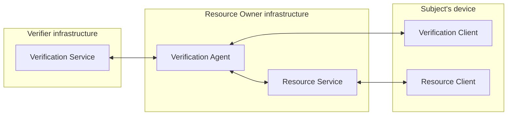
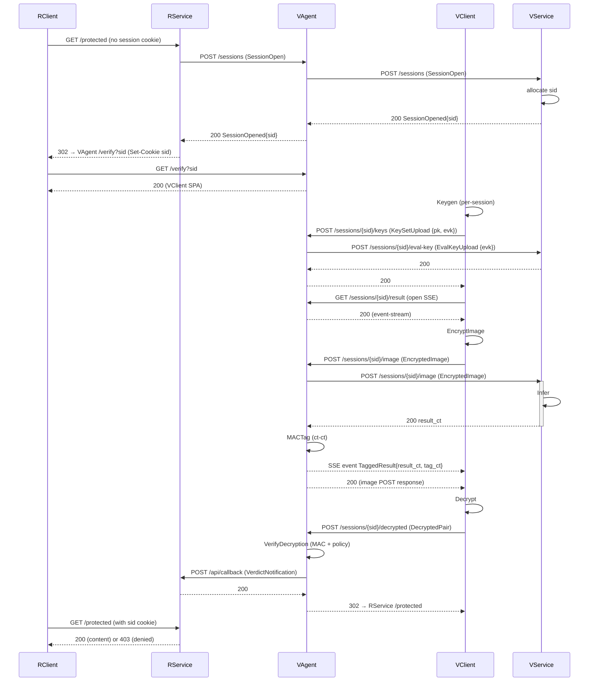

# PPIAV design

**Privacy-Preserving Image Attribute Verification.** End-to-end demonstrator of FHE-based facial-attribute verification: a verifier runs an ML model on a CKKS-encrypted image and returns an encrypted result; the user decrypts; an agent confirms the decryption against policy. Demonstration case: age estimation via C3AE.

This document is the single source of truth for the architecture. Any deviation in code requires updating this doc first.

---

## Context

Companion materials live alongside this repo and inform the design.

- **Thesis** — `~/Dev/ITMO/thesis/`. ITMO bachelor's thesis (Russian). The assignment is at `task/TASK.md`.
- **Presentation** — `~/Dev/ITMO/thesis/presentation/presentation.typ`. Early draft of the components and protocol. **Outdated relative to this doc**; when in conflict, this design wins.

Reference repositories — read for understanding, do **not** copy code from them or from the thesis experiments (`~/Dev/ITMO/thesis/experiments/`). Write fresh idiomatic Go.

- **Orion** (our fork) — `~/Dev/orion/`, https://github.com/butvinm/orion. FHE deep-learning compiler; used from Phase 2 for model compilation and the WASM crypto bridge.
- **Lattigo** — `~/Dev/3rd-party/lattigo/`. CKKS library; the only crypto dependency in Phase 1.
- **lattigo-hierkeys** — `~/Dev/lattigo-hierkeys/`, https://github.com/butvinm/lattigo-hierkeys. Hierarchical rotation keys; integrated in Phase 4.

---

## Threat model

Three parties; each has a distinct adversarial profile.

- **Subject (client) — covert adversary.** May deviate from the protocol to bypass verification, but avoids being detected. Defense: a MAC bound to the encrypted result forces the client to return a value consistent with what VAgent homomorphically tagged.
- **Verifier (VService) — semi-honest.** Follows the protocol but tries to extract information from observed data. Defense: FHE — VService never sees plaintexts;
- **Resource Owner (VAgent, RService) — semi-honest.** Follows the protocol but tries to extract information from observed data. Defense: VAgent observes only the decrypted result vector (model output, not the input image) plus the resulting verdict. The result vector itself does leak something beyond the binary verdict; that quantitative leakage analysis lives in the thesis, not here. RService receives the verdict; never receives personal data.

**Out of scope.** Authentication, TLS, rate limiting, presentation-attack detection (deepfake / spoofing), input sanitization beyond what the protocol demands, malicious-server defenses. The thesis explicitly deprioritizes these.

---

## Components



- **VService.** Runs FHE inference on the encrypted image. Issues session IDs.
- **VAgent.** Mediates the protocol: forwards keys and image between VClient and VService, tags the encrypted result with a MAC, applies the verdict policy on the decrypted plaintexts, calls RService back with the verdict.
- **VClient.** Subject-side crypto: per-session keygen, image encryption, decryption of the (result, tag) pair, posting plaintexts back to VAgent.
- **RService.** Owns the gated resource. Initiates verification on first hit, receives the verdict via callback, gates content on subsequent hits.
- **RClient.** User-facing protected page.

Implementation tech (Go HTTP services, browser SPA, WASM, Docker) is described per package in §Implementation. The component definition above is implementation-agnostic — for example, VAgent could be a sidecar service or an in-process library, as long as it lives in the resource-owner's infrastructure.

---

## Protocol



### Stage 1: Session initiation

1. The user's browser requests a gated resource from RService and presents no session cookie.
2. RService asks VAgent to start a verification flow.
3. VAgent forwards the request to VService, which is the authoritative session issuer.
4. VService allocates a fresh, opaque session ID and returns it to VAgent.
5. The session ID propagates back through VAgent to RService.
6. RService records the session ID, sets a session cookie on the browser, and redirects to VAgent's verification page.
7. The browser follows the redirect and loads the VClient SPA from VAgent.

### Stage 2: Keys and image exchange

1. VClient generates a fresh CKKS key set for this session: secret key (kept local), public key, and evaluation key.
2. VClient sends both keys to VAgent. VAgent forwards only the evaluation key to VService — VService needs it for inference but never sees the public key. VAgent retains both: the public key for encrypting MAC scalars, the evaluation key for the homomorphic MAC step.
3. VClient opens a server-sent-events connection to VAgent. The eventual tagged result will arrive over this channel; opening it before submitting the image avoids a race.
4. VClient encrypts the user-supplied image into a CKKS ciphertext.
5. VClient sends the ciphertext to VAgent, which forwards it to VService.

### Stage 3: Inference

1. VService runs the FHE-compatible model on the encrypted image and produces an encrypted result.
2. VService returns the result ciphertext to VAgent.
3. VAgent computes a MAC tag over the encrypted result, binding it to per-session secret material that the client cannot guess. The mechanism is described in §MAC.
4. VAgent streams the (result, tag) ciphertext pair to VClient over SSE.
5. VClient decrypts both ciphertexts, obtaining a plaintext result vector and a plaintext tag vector.
6. VClient posts the two plaintext vectors back to VAgent.

### Stage 4: Verdict

1. VAgent checks the MAC: the returned tag must be consistent with the result the client claims to have decrypted, otherwise the client tampered with the value. VAgent then applies the policy (e.g., age threshold) to derive a binary verdict.
2. VAgent calls RService's verdict callback with the result for this session ID.
3. VAgent redirects the browser back to RService.
4. The browser hits the original gated URL with its session cookie. RService looks up the verdict and serves either the content or a denied page.

---

## MAC

_TODO — to be filled in._

---

## Implementation

We deliver a Go-first prototype that grows in four phases. Phase 1 is a single CLI binary running all actors in one process with a benchmark harness; later phases swap the synthetic circuit for a real model, split actors into HTTP services, and add browser SPAs.

| Phase | Scope                                                                                              |
| ----- | -------------------------------------------------------------------------------------------------- |
| 1     | Real CKKS, synthetic `x²` circuit, in-process actors orchestrated by `ppiav-cli`, JSON benchmarks. |
| 2     | Orion-compiled C3AE inference replaces `x²`; CKKS params sourced from the Orion manifest.          |
| 3     | HTTP services and browser SPAs.                                                                    |
| 4     | Hierarchical rotation keys via lattigo-hierkeys, exposed through the WASM bridge.                  |

### Layout

```
ppiav/
├── cmd/
│   ├── ppiav-cli/                     # Phase 1+ benchmark CLI
│   ├── ppiav-vservice/                # Phase 3+
│   ├── ppiav-vagent/                  # Phase 3+
│   └── ppiav-rservice/                # Phase 3+
├── internal/
│   ├── protocol/                      # Domain types, wire messages, parameter sets (CKKS, MAC, Orion)
│   ├── mac/                           # Per-session MAC scheme (used by vagent)
│   ├── vclient/                       # Subject-side crypto
│   ├── vservice/                      # FHE inference; sid issuer
│   ├── vagent/                        # Protocol mediator; MAC application; verdict policy
│   ├── rservice/                      # Resource gating
│   └── bench/                         # Measurement harness
├── web/
│   ├── ppiav/                         # WASM module — Orion's js/lattigo + ppiav protocol API
│   ├── vclient/                       # SPA served by VAgent
│   └── rclient/                       # SPA served by RService
├── models/                            # Phase 2+ Python uv project (C3AE)
├── bench/                             # Phase 1+ Python uv project (plots, tables)
├── deploy/                            # Phase 3+ Dockerfiles
├── results/                           # JSON + plots (selectively committed snapshots)
├── docs/
│   └── DESIGN-2.md
├── go.mod
└── README.md
```

### Components

#### `internal/protocol`

Domain types, wire messages, and the parameter sets all parties must agree on. Real protocols (TLS, TCP) include parameter definitions as part of the protocol specification — same logic applies here. All Lattigo wire-relevant types implement `encoding.BinaryMarshaler`/`BinaryUnmarshaler` natively.

```go
package protocol

import (
    "github.com/tuneinsight/lattigo/v6/core/rlwe"
    "github.com/tuneinsight/lattigo/v6/schemes/ckks"
    "github.com/tuneinsight/lattigo/v6/ring"
)

type SessionID string

type Verdict uint8
const (
    VerdictUnknown Verdict = iota
    VerdictAccept
    VerdictReject
)

type PublicKeySet struct {
    PK  *rlwe.PublicKey
    Evk *rlwe.MemEvaluationKeySet
}

func (m PublicKeySet) MarshalBinary() ([]byte, error)
func (m *PublicKeySet) UnmarshalBinary(data []byte) error
```

Parameters — defaults grow over phases (CKKS now; MAC fields when §MAC is fleshed out; Orion params arrive in Phase 2):

```go
func DefaultCKKSParams() (ckks.Parameters, error)
```

Defaults for Phase 1: `LogN=15`, `LogQ=[51,40×15]`, `LogP=[50×4]`, `LogDefaultScale=40`, `RingType=Standard`. 15 multiplicative levels, 128-bit security at LogN=15. In Phase 2, defaults are derived from the Orion manifest instead.

Wire messages — payload nouns; direction is implicit in the HTTP route.

```go
type SessionOpen          struct{}
type SessionOpened        struct { SessionID SessionID }
type KeySetUpload         struct { Keys PublicKeySet }            // VClient → VAgent
type EvalKeyUpload        struct { Evk  *rlwe.MemEvaluationKeySet } // VAgent → VService
type EncryptedImage       struct { Ct *rlwe.Ciphertext }
type TaggedResult         struct { Result, Tag *rlwe.Ciphertext }
type DecryptedPair        struct { Result, Tag []float64 }
type VerdictNotification  struct { Verdict Verdict }
```

`SessionOpened` carries the sid that VService allocated; subsequent routes carry sid in the URL path. The key-upload message is split: VClient sends the full `KeySetUpload` (pk + evk) to VAgent, which forwards only the evaluation key as `EvalKeyUpload` — VService never sees the public key. Ciphertexts travel as `*rlwe.Ciphertext` directly — they already satisfy `BinaryMarshaler`.

#### `internal/mac`

Per-session MAC secrets and tag computation. Used by VAgent in `MACTag` and `VerifyDecryption`. Construction details, parameter choices, and the verify tolerance ε live in §MAC.

```go
package mac

import (
    "github.com/tuneinsight/lattigo/v6/core/rlwe"
    "github.com/tuneinsight/lattigo/v6/schemes/ckks"
)

type Secret struct{ /* TBD — see §MAC */ }

func NewSecret(slots int) (Secret, error)

// Tag computes tag_ct from result_ct via ciphertext × ciphertext operations
// — the per-session secret material is encrypted under the session's pk and
// combined with result_ct. Requires a per-session Encryptor (built from pk)
// and a per-session Evaluator (built from evk; relinearization needed).
func (s Secret) Tag(
    enc *ckks.Encoder,
    encryptor *rlwe.Encryptor,
    eval *ckks.Evaluator,
    resultCt *rlwe.Ciphertext,
) (*rlwe.Ciphertext, error)

// Verify checks tag against result within ε.
func (s Secret) Verify(result, tag []float64, eps float64) bool
```

#### `internal/vclient`

Subject-side crypto. Holds the secret key. Must compile under `linux/amd64` and `js/wasm` (no cgo, no filesystem access).

```go
package vclient

type Client struct {
    params    ckks.Parameters
    sk        *rlwe.SecretKey
    encoder   *ckks.Encoder
    encryptor *rlwe.Encryptor
    decryptor *rlwe.Decryptor
}

func New(params ckks.Parameters) *Client

func (c *Client) Keygen() (protocol.PublicKeySet, error)
func (c *Client) EncryptImage(image []float64) (*rlwe.Ciphertext, error)
func (c *Client) Decrypt(resultCt, tagCt *rlwe.Ciphertext) (result, tag []float64, err error)
```

#### `internal/vservice`

FHE inference engine. **Issues session IDs.** Holds per-session evaluator state.

```go
package vservice

type Service struct {
    params   ckks.Parameters
    sessions map[protocol.SessionID]*sessionState
    mu       sync.Mutex
}

type sessionState struct {
    eval *ckks.Evaluator
}

func New(params ckks.Parameters) *Service

func (s *Service) OpenSession() (protocol.SessionID, error)
func (s *Service) StoreEvalKey(sid protocol.SessionID, evk *rlwe.MemEvaluationKeySet) error
func (s *Service) Infer(sid protocol.SessionID, inputCt *rlwe.Ciphertext) (*rlwe.Ciphertext, error)
```

`OpenSession` draws fresh randomness (≥128 bits), reserves a session-table slot, and returns the sid. The per-session `Evaluator` is built from the evk in `StoreEvalKey`. VService only ever receives the evaluation key — never the public key.

#### `internal/vagent`

Protocol mediator: builds per-session crypto primitives from the uploaded keys, computes MAC tags via ct-ct operations, verifies decrypted plaintexts against the MAC and policy.

```go
package vagent

type Agent struct {
    params   ckks.Parameters
    eps      float64
    encoder  *ckks.Encoder
    sessions map[protocol.SessionID]*sessionState
    mu       sync.Mutex
}

type sessionState struct {
    encryptor *rlwe.Encryptor   // built from pk; encrypts MAC scalars
    eval      *ckks.Evaluator   // built from evk; ct-ct mul + relinearize
    mac       mac.Secret
}

func New(params ckks.Parameters, eps float64) (*Agent, error)

func (a *Agent) OpenSession(sid protocol.SessionID) error
func (a *Agent) StoreKeys(sid protocol.SessionID, keys protocol.PublicKeySet) error
func (a *Agent) MACTag(sid protocol.SessionID, resultCt *rlwe.Ciphertext) (*rlwe.Ciphertext, error)
func (a *Agent) VerifyDecryption(sid protocol.SessionID, result, tag []float64) (protocol.Verdict, error)
```

`OpenSession(sid)` registers the sid that VService allocated. `StoreKeys` builds the per-session `*rlwe.Encryptor` from `pk` and `*ckks.Evaluator` from `evk`, retaining the derived primitives in `sessionState`; the keys themselves are not kept. `MACTag` writes the per-session MAC secret; `VerifyDecryption` reads it once and zeroes (single-use invariant).

#### `internal/rservice`

Owns the gated resource; receives verdicts from VAgent.

```go
package rservice

type Service struct {
    sessions map[protocol.SessionID]protocol.Verdict
    mu       sync.Mutex
}

func New() *Service

func (s *Service) AcceptVerdict(sid protocol.SessionID, v protocol.Verdict) error
func (s *Service) CheckAccess(sid protocol.SessionID) protocol.Verdict
```

`AcceptVerdict` upserts. `CheckAccess` returns `VerdictUnknown` for missing sids — indistinguishable from "verification still in flight". The cookie set by RService at redirect time is the authoritative "this browser started a flow" signal; no separate pending-session table is needed.

#### `internal/bench`

Measurement harness used by `cmd/ppiav-cli` and tests. Pure Go, stdlib + `runtime/debug`. Emits per-call samples (wall time, heap, GC, optional artifact size); aggregation happens in Python.

```go
package bench

type Sample struct {
    Name       string
    Iter       int
    Wall       time.Duration
    HeapAlloc  uint64
    HeapInuse  uint64
    Sys        uint64
    AllocDelta uint64
    NumGC      uint32
    PauseNs    uint64
    VmHWM      uint64        // Linux only
    Bytes      uint64        // optional artifact size
}

type Run struct {
    Name      string
    Phase     string
    Started   time.Time
    GoVersion string
    GOOS      string
    GOARCH    string
    NumCPU    int
    Metadata  map[string]any
    Samples   []Sample
}

func Measure(name string, fn func() error) (Sample, error)
func MeasureWithSize(name string, fn func() (size uint64, err error)) (Sample, error)
func Repeat(n int, name string, fn func() error) ([]Sample, error)
func RepeatWithWarmup(n, warmup int, name string, fn func() error) ([]Sample, error)

func NewRun(name, phase string) *Run
func (r *Run) Append(s ...Sample)
func (r *Run) WriteJSON(path string) error
```
