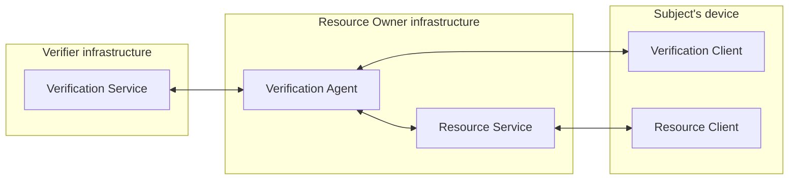
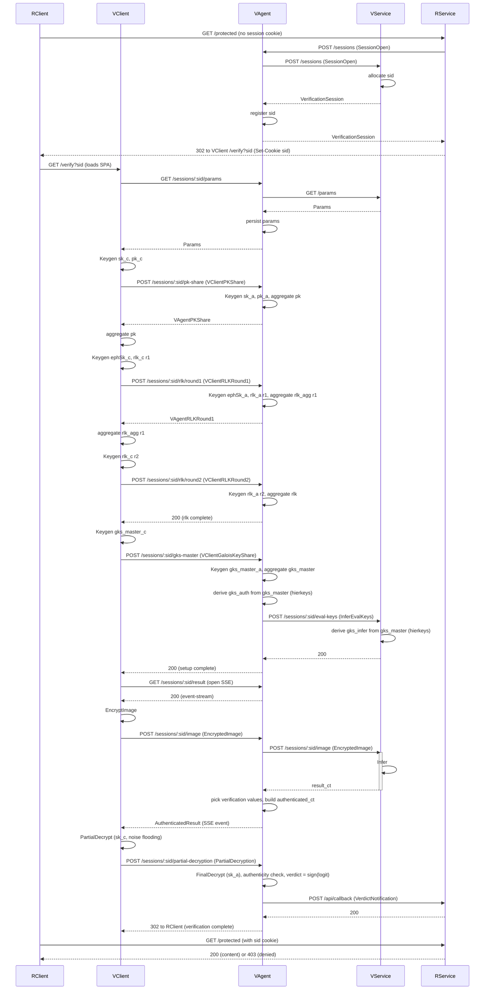

# PPIAV design

**Privacy-Preserving Image Attribute Verification.** End-to-end demonstrator of FHE-based facial-attribute verification: a verifier runs an ML model on a CKKS-encrypted image and returns an encrypted result; the two parties jointly decrypt; the agent reads the recovered logit and binarises it. Demonstration case: age estimation via C3AE, framed as a binary classifier (above/below age threshold) — the threshold is baked into the model at training time, not a runtime parameter.

This document is the single source of truth for the architecture. Any deviation in code requires updating this doc first.

---

## Context

Companion materials live alongside this repo and inform the design.

- **Thesis** — `~/Dev/ITMO/thesis/`. ITMO bachelor's thesis (Russian). The assignment is at `task/TASK.md`.
- **Thesis text** — `~/Dev/ITMO/thesis/thesis/` (Typst sources: `thesis.typ`, `protocol.typ`, `refs.bib`, etc.). Authoritative narrative for the protocol, threat model, and quantitative analysis. The protocol diagram in this repo (`docs/protocol.puml`) is synced from `~/Dev/ITMO/thesis/thesis/protocol.puml`; when they disagree, the thesis text wins.

Reference repositories — read for understanding, do **not** copy code from them or from the thesis experiments (`~/Dev/ITMO/thesis/experiments/`). Write fresh idiomatic Go.

- **Orion** (our fork) — `~/Dev/orion/`, https://github.com/butvinm/orion. FHE deep-learning compiler; used from Phase 2 for model compilation and the WASM crypto bridge.
- **Lattigo** — `~/Dev/3rd-party/lattigo/`. CKKS library; the only crypto dependency in Phase 1.
- **lattigo-hierkeys** — `~/Dev/lattigo-hierkeys/`, https://github.com/butvinm/lattigo-hierkeys. Hierarchical rotation keys; integrated in Phase 4.

---

## Threat model

Three parties; each has a distinct adversarial profile.

- **Subject (client) — covert adversary.** May deviate from the protocol to bypass verification, but avoids being detected. Defense: multi-party CKKS. The secret key is additively split into `sk_c` (held by VClient) and `sk_a` (held by VAgent); neither party alone can decrypt. After inference VAgent folds secret verification values into the result ciphertext (authenticated ciphertext) and the two parties run a joint decryption: VClient produces a partial decryption under `sk_c` (with noise flooding so the share leaks no information about `sk_c`), VAgent finalises with `sk_a` and recovers the plaintext. Because the verification values are unknown to the client, any deviation from honest partial decryption corrupts them and is detected. The client never sees the plaintext result — VAgent does.
- **Verifier (VService) — semi-honest.** Follows the protocol but tries to extract information from observed data. Defense: FHE — VService only ever sees ciphertexts (image, eval keys, result) and never holds any secret share.
- **Resource Owner (VAgent, RService) — semi-honest.** Follows the protocol but tries to extract information from observed data. Defense: VAgent observes only the decrypted result vector (model output, not the input image) plus the resulting verdict. The result vector itself does leak something beyond the binary verdict; that quantitative leakage analysis lives in the thesis, not here. RService receives the verdict; never receives personal data.

**Out of scope.** Authentication, TLS, rate limiting, presentation-attack detection (deepfake / spoofing), input sanitization beyond what the protocol demands, malicious-server defenses. The thesis explicitly deprioritizes these.

---

## Components



- **VService.** Runs FHE inference on the encrypted image. Issues session IDs. Receives the aggregated relinearization key and the aggregated Galois keys from VAgent. In the canonical (Phase 4) form the Galois-key wire payload is `gks_master`, from which VService derives the per-rotation `gks` hierarchically via lattigo-hierkeys; in Phase 1–3 VService receives the already-assembled full Galois key set instead — same protocol shape, simpler transport.
- **VAgent.** Mediates the protocol _and_ holds one half of the secret key (`sk_a`). Generates and contributes its key shares to every collaborative key (public key, two-round rlk, Galois keys), forwards the aggregated `rlk` and Galois keys to VService, builds the authenticated ciphertext over the inference result, performs the final step of the joint decryption, checks authenticity, binarises the recovered logit (`accept iff logit > 0`), calls RService back with the verdict.
- **VClient.** Subject-side crypto. Holds the other half of the secret key (`sk_c`). Per-session generates `sk_c`, `pk_c`, ephemeral `ephSk_c`, the two rlk shares `rlk_c⁽¹⁾`/`rlk_c⁽²⁾`, and its Galois-key shares; aggregates the public components with VAgent's matching shares; preprocesses the user-supplied image to the model's input tensor (resize to 64×64, normalize to `[-1, 1]`, CHW layout, see §`internal/vclient`); encrypts the tensor; runs the partial decryption (its share of the joint decryption) with noise flooding before returning the partially-decrypted ciphertext to VAgent. **Never sees the plaintext result.**
- **RService.** Owns the gated resource. Initiates verification on first hit, receives the verdict via callback, gates content on subsequent hits.
- **RClient.** User-facing protected page.

Implementation tech (Go HTTP services, browser SPA, WASM, Docker) is described per package in §Implementation. The component definition above is implementation-agnostic — for example, VAgent could be a sidecar service or an in-process library, as long as it lives in the resource-owner's infrastructure.

---

## Protocol

The canonical sequence diagram lives in `docs/protocol.puml` (PlantUML, synced from `~/Dev/ITMO/thesis/thesis/protocol.puml`). The Mermaid below is the same flow re-rendered in concise English with HTTP-route hints for the implementation; we keep it inline because it survives Markdown rendering anywhere (GitHub, IDE preview) without a PlantUML pipeline. When the two disagree, the thesis PUML wins; resync this one.

**Both diagrams describe the final (Phase 4) protocol state.** Phases 1–3 may deviate where called out in the prose — notably Stage 2d's Galois-key transport, where Phase 1–3 emits one share per rotation and ships the full assembled `gks` set, while Phase 4 collapses the wire payload to `gks_master` and both VAgent and VService hierarchically derive their own per-rotation keys (`gks_auth` and `gks_infer` respectively).



### Stage 1: Session initiation

1. The user's browser requests a gated resource from RService and presents no session cookie.
2. RService asks VAgent to start a verification flow.
3. VAgent forwards the request to VService, which is the authoritative session issuer.
4. VService allocates a fresh, opaque session ID and returns it through VAgent (which registers it) back to RService.
5. RService records the session ID, sets a session cookie on the browser, and redirects to VClient's verification page.
6. The browser follows the redirect and loads the VClient SPA (served by VAgent at `/verify?sid`). From this point on, the user interacts with VClient until the flow terminates with a redirect back to RClient.

### Stage 2: Collaborative setup

The session-specific CKKS keys are generated jointly by VClient and VAgent. The secret key is additively shared (`sk = sk_c + sk_a`) and **never reconstructed in any single place**. The aggregated public components (pk, rlk, Galois keys) are what gets shipped to VService for inference.

1. **Parameters.** VClient fetches the protocol parameters (ring degree, modulus chain, scale, authenticator configuration) from VAgent, which sources them from VService. VAgent persists its copy under the sid. The CRS that both parties feed to the multi-party keygen protocols is **derived deterministically from the sid** — no extra seed material crosses the wire (see the CRS construction under §`internal/protocol` below).
2. **Public key (one round).** VClient generates `sk_c, pk_c` and sends `pk_c` to VAgent. VAgent generates its own `sk_a, pk_a`, aggregates `pk = pk_c + pk_a`, and returns `pk_a` to VClient so it can compute the same aggregate locally.
3. **Relinearization key (two rounds).** Both rounds follow the same client-share-then-agent-share pattern. Round 1: VClient generates an ephemeral secret `ephSk_c` and its first-round share `rlk_c⁽¹⁾`; VAgent generates its own `ephSk_a, rlk_a⁽¹⁾`; both sides aggregate `rlk⁽¹⁾_agg`. Round 2: VClient generates `rlk_c⁽²⁾`, VAgent generates `rlk_a⁽²⁾`, both aggregate the final `rlk`. The two-round structure follows the standard multi-party CKKS relinearization protocol.
4. **Rotation keys.** Both parties contribute matching `multiparty.GaloisKeyGenShare` shares for the rotations the compiled circuit and `Auth` need. The canonical (Phase 4) form, shown in the diagram, collapses the per-rotation shares into a single `gks_master` pair (`gks_master_c`, `gks_master_a` → `gks_master`). VAgent forwards `rlk` and `gks_master` to VService as `InferEvalKeys`; VAgent and VService then independently expand `gks_master` into the per-rotation keys each side actually uses — `gks_auth` at VAgent (for `Auth`'s rotation-and-sum), `gks_infer` at VService (for the inference circuit) — via lattigo-hierkeys. This is purely a transport-and-storage optimisation. Phase 1–3 skip the master/derive step: VClient and VAgent emit one share per rotation, aggregate the assembled `gks` directly, and ship the full set to VService (VAgent uses the same assembled set locally). The multi-party protocol is identical; only the wire shape differs.
5. **Result channel.** VClient opens a server-sent-events connection to VAgent for the eventual authenticated result. Opening it before submitting the image avoids a race.

### Stage 3: Image submission and inference

1. VClient encrypts the user-supplied image under the aggregated `pk`.
2. VClient sends the ciphertext to VAgent, which forwards it to VService.
3. VService runs the FHE-compatible model on the encrypted image, producing `result_ct`, and returns it to VAgent.

### Stage 4: Authenticated joint decryption and verdict

1. **Authenticated ciphertext.** VAgent picks fresh secret verification values and folds them into `result_ct` to produce an authenticated ciphertext bound to this session's secret material. The construction is described in §Multiparty decryption with authentication.
2. **Partial decryption.** VAgent streams the authenticated ciphertext to VClient over SSE. VClient runs the first step of the joint decryption using `sk_c`, adding flood noise to mask its secret share, and posts the partially-decrypted ciphertext back to VAgent. VClient never recovers a plaintext.
3. **Final decryption and authenticity check.** VAgent completes the decryption with `sk_a`, recovers the plaintext result vector, and checks that the verification values it injected come out intact. A mismatch indicates the client deviated from the protocol; VAgent aborts with a reject verdict.
4. **Verdict.** The C3AE model emits a binary-classifier logit at slot 0 (positive = "above the trained age threshold"). VAgent binarises directly: `Verdict = Accept` iff the recovered `m > 0`, else `Reject`. There is no runtime threshold or policy interface — the classification boundary is baked into model training. (Equivalent statement: `sigmoid(m) > 0.5`. Same decision.)
5. **Callback and redirect.** VAgent calls RService's verdict callback with the result for this sid. RService persists the verdict. VAgent then signals VClient that verification is complete; VClient redirects the browser back to RService. The browser hits the original gated URL with its session cookie, RService looks up the verdict, and serves either the content or a denied page.

---

## Failure modes

The happy path runs Stages 1–4 to a `Verdict = Accept` or `Verdict = Reject`. **Once a session is opened**, every non-happy-path outcome collapses into `Verdict = Reject` delivered through the standard Stage 4 callback — same wire shape, same RService 403, same UX for the user. No `Verdict = Error` variant. The one exception is F4a below: if VService is unreachable during Stage 1, no sid is ever issued, so there is no session to deliver a verdict against — the failure surfaces only as a 5xx to the user from RService.

| ID  | Trigger                             | Where                | Resolution                                                                                                                                      |
| --- | ----------------------------------- | -------------------- | ----------------------------------------------------------------------------------------------------------------------------------------------- |
| F1  | `Ver` returns false                 | Stage 4, VAgent      | `Verdict = Reject` to RService. Session torn down.                                                                                              |
| F2  | Malformed wire input                | Any stage            | HTTP 400 to the offending party (Phase 3) / Go error return (Phase 1) **plus** `Verdict = Reject` to RService. Session torn down.               |
| F3  | Inference error                     | Stage 3, VService    | VS returns error to VAgent; VAgent surfaces `Verdict = Reject` to RService. Session torn down.                                                  |
| F4a | VService unreachable, Stage 1 setup | Stage 1, VAgent      | No sid is issued; VAgent returns an error to RService; RService returns its own 5xx to the user. No session is opened, so nothing to tear down. |
| F4b | VService unreachable, Stages 2–3    | Stage 2 or 3, VAgent | After retry budget exhausted, VAgent emits `Verdict = Reject` to RService. Session torn down.                                                   |

### F1: forgery vs. noise are indistinguishable on purpose

After joint decryption, a tampered partial-decryption share and an honest decryption whose intrinsic noise happened to exceed `ε` produce the same observable: `Ver` returns false. The only way to attribute cause would be to inspect the noise distribution in the recovered plaintext — speculative, low-signal, and an information leak that gives a covert client a learning signal across retries.

We do not try. The correctness contract is "with our chosen `ε` and `σ_flood`, honest decryption passes with overwhelming probability." If `Ver` failures show up at non-negligible rate on legitimate flows, the response lives in §Noise — raise `ε` (and bump `σ_flood` with it), don't add forensic logic at the verdict layer.

### Wire-shape impact

- `protocol.Verdict` stays `{Unknown, Accept, Reject}` — no `Error` variant.
- `Verdict = Unknown` is the marker RService uses for "session was opened but no verdict has been delivered yet"; RService treats Unknown as deny-by-default and returns 403 on resource fetch until either Accept or Reject arrives.
- The same VAgent → RService callback (`POST /api/callback`) carries all verdict deliveries, including the failure-mode rejects.

### No protocol-level timeouts

The protocol does **not** impose per-stage timeouts. A VClient that stalls (browser tab closed mid-flow, network partition, slow keygen on a low-end device) leaves the session sitting in VAgent's session table; cleanup is the job of session lifecycle / TTL (separate gap), not per-stage timeouts. RService sees the session as `Unknown` for the whole stall — denying the user the same way a `Reject` would — so the user-visible outcome of "abandoned session" and "delivered Reject" is identical. Failure-mode parity is preserved without explicit timeouts, and Phase-3 HTTP transport stays free of per-route timeout middleware.

---

## Multiparty decryption with authentication

We deliberately avoid the term **verifiable decryption** because it has a precise meaning in the cryptography literature (typically: a NIZK proof that a decryption is correct). Our construction does something different: VAgent embeds a secret authentication pattern into the ciphertext before the joint decryption, then checks the pattern survived after the decryption completes. We call it **MPD-Auth** (multiparty decryption with authentication).

### Parameters

`λ` and `ε` live in `authenticator.Config`; `σ_flood` lives in `protocol.Params` because it's a VClient-side knob (the authenticator itself never floods). `|S|` is derived (not configured).

| Param     | Default           | Lives in               | Role                                                                                                                                                                                             |
| --------- | ----------------- | ---------------------- | ------------------------------------------------------------------------------------------------------------------------------------------------------------------------------------------------ |
| `λ`       | 128               | `authenticator.Config` | Security parameter; total authentication slots used.                                                                                                                                             |
| `\|S\|`   | `λ/2 = 64`        | _derived_              | Number of verification (random-pattern) slots; the remaining `λ - \|S\|` slots replicate the inference message `m`. Always `λ/2` — not a configurable knob.                                      |
| `Q_0`     | level-0 modulus   | `ckks.Parameters`      | The base prime `q_0` of the CKKS modulus chain — the largest single prime in `LogQ` (55 bits at Phase 1 defaults). Bounds the verification-value distribution. See note below on chain notation. |
| `ε`       | `2^20`            | `authenticator.Config` | Approximate-equality tolerance for `Ver`, expressed in **scaled-message space** (i.e., before the decoder divides by Δ).                                                                         |
| `σ_flood` | `2^16`            | `protocol.Params`      | Std of the discrete-Gaussian flooding noise VClient adds during partial decryption. Constant, independent of `ε` and the circuit (see §Noise for the why).                                       |
| `F`       | session-fresh PRG | _session-local_        | Deterministic from a session-fresh seed; samples uniformly from `(-Q_0/2, Q_0/2)`.                                                                                                               |

VAgent owns `S`, the seed of `F`, and (consequently) the verification vector `v`. VClient learns `λ`, `ε`, and `σ_flood` via the params fetch (`|S|` follows from `λ`). All authentication secrets stay on the VAgent side.

**Note on chain notation.** We use the convention `Q_chain = [q_0, q_1, ..., q_L]`, where `q_0` is the base prime (55 bits at Phase 1 defaults) and `q_1..q_L` are the rescaling primes each ≈ `log2(Δ)` bits (~40 bits in Phase 1). At fresh encryption the ciphertext is at level `L` with modulus `Q_L = q_0 · q_1 · … · q_L`; each rescaling drops the top prime; what survives at level 0 is `Q_0 = q_0`. So `Q_0` here refers to the same prime that's largest in absolute size and is the one left after all rescalings — _not_ a small "leftover" prime. (Note: the `LogP` "special primes" used for keyswitching are a separate set and are not part of `Q_chain`.)

Assumption on the inference circuit: the message `m` (the prediction) lives in slot 0 of `result_ct`. Other slots are _not_ assumed to be zero — the circuit may leave arbitrary garbage there. `Auth`'s first step explicitly masks them out so the rotation-and-sum that follows produces a clean replicated-`m` pattern.

### Auth (VAgent, post-inference)

Input: `result_ct` from VService, with `m` at slot 0 and arbitrary garbage in other slots.

1. **Mask to slot 0.** Encode the plaintext `pt_one_hot = [1, 0, 0, ..., 0]` at **scale 1** (raw values, no Δ multiplication — this plaintext is reusable across sessions). Compute
   ```
   ct_m = result_ct · pt_one_hot
   ```
   This is a ciphertext × plaintext multiplication. Scale arithmetic: `Δ · 1 = Δ`, so the result stays at scale Δ — **no rescaling is needed and no modulus-chain level is consumed**. Ciphertext × plaintext also skips relinearization. Slot 0 of `ct_m` is `m`; every other slot is `0`.
2. Sample `S ⊂ [0, λ)`, `|S| = λ/2`, uniformly at random.
3. Build the verification vector `v` of length `λ`:
   - `v[i] = F(i)` if `i ∈ S`, otherwise `v[i] = 0`.
   - The `F(i)` values are already in **scaled space** — they are placed directly into the plaintext slot coefficients with _no_ multiplication by Δ.
4. Build the replicated-message ciphertext by rotating the masked `ct_m`:
   ```
   ct_m^Rep = Σ_{j ∈ [0, λ) \ S}  Rot(ct_m, j)
   ```
   Because `ct_m` has `m` only at slot 0 and zero elsewhere, `Rot(ct_m, j)` has `m` only at slot `j`. Summing over `j ∈ [0, λ) \ S` therefore puts `m` exactly at the value-slot positions: slots in `[0, λ) \ S` carry `m`, slots in `S` carry `0`, slots `≥ λ` carry `0`.
5. Encrypt `v` under the aggregated session `pk` at the scale of `ct_m^Rep` (i.e., scale Δ) to get `ct_v`.
6. The **authenticated ciphertext** is
   ```
   ct_M = ct_m^Rep + ct_v
   ```
   with expected per-slot plaintext:
   - `i ∈ [0, λ) \ S`: `m`
   - `i ∈ S`: `v[i] / Δ` (because `v[i]` was placed unscaled and CKKS decoding divides by Δ)
   - `i ≥ λ`: 0 (we only check `[0, λ)`).

VAgent retains `(S, seed_F, scale_of_v)` to drive the post-decryption check.

### Ver (VAgent, post-decryption)

Input: plaintext slot vector `P` recovered from the joint decryption.

Define `a ≈ε b` iff `|a·Δ - b·Δ| < ε` — comparison in scaled-message space.

Accept iff **both**:

1. **Verification slots match.** For all `i ∈ S`: `P[i] ≈ε v[i] / Δ`, where `v[i] = F(i)`.
2. **Value slots agree.** Pick any single reference `j* ∈ [0, λ) \ S` (e.g., the smallest). For all `i ∈ [0, λ) \ S`: `P[i] ≈ε P[j*]`.

If both pass, the recovered message is `m_recovered = P[j*]` — the binary-classifier logit. VAgent emits `Accept` iff `m_recovered > 0`. (Edge case: if `|m_recovered| < ε` after a passing `Ver`, the verdict is whichever side of zero the noise lands on. The thesis quantifies the probability mass of that ambiguous region; we do not add a special "abstain" verdict at the prototype level.)

### Security analysis

Out of scope for this document. Unforgeability bounds, soundness-under-flooding, and the no-leakage-to-VClient argument live in the thesis (`~/Dev/ITMO/thesis/thesis/protocol.typ`). This document specifies the construction; concrete bounds and proofs are not duplicated here.

### Implementation notes

- **Rotations are needed from Phase 1.** `Auth` step 4 calls `Rot(ct_m, j)` for `j ∈ [0, λ) \ S`. Even the Phase-1 synthetic `x²` inference circuit therefore exercises rotation keys: the collaborative `multiparty.GaloisKeyGen` handshake produces Galois keys for indices `1..λ-1` so that `Auth` can run.
- **Rotation count.** Naïve `Auth` does one ct × pt mask multiplication and `λ - |S| = 64` rotations followed by an addition tree. `Evaluator.InnerSum`-style tree reductions can cut the rotation count to `O(log λ)` with appropriate Galois-key selection — a Phase-2 optimisation once bench numbers show the cost.
- **The mask plaintext is reusable.** `pt_one_hot = [1, 0, ..., 0]` at scale 1 is session-independent: encode it once per `authenticator.Config` (when params are loaded) and reuse across every session's `Auth`.
- **Phase 4 rotation composition (asymmetric scheme).** VAgent and VService both need rotation keys but follow different routes; their constraints differ and the wire optimisation pays off differently for each.
  - **VAgent — decompose at use, no hierkeys.** Auth's rotate-and-sum loop calls `RotateNew(ct, -j)` for `j ∈ [1, λ) \ S` where `|S| = λ/2`. We control the rotation indices, so we pick a tiny base-2 atom set `{1, 2, 4, 8, 16, 32, 64}` (7 atoms at `λ = 128`) and chain each logical rotation by binary decomposition: e.g. `j = 69 = 64 + 4 + 1` becomes `Rot(·, -64) → Rot(·, -4) → Rot(·, -1)`. Chain length per rotation is `popcount(|j|)` — max 7, mean 3.52 over the 64 non-S rotations Auth uses. The auth atom keys are direct multi-party `*rlwe.GaloisKey`s minted at `GaloisElement(-atom)` at eval level; **no lattigo-hierkeys derivation** at VAgent. The library buys nothing here — derivation only earns its keep when one master atom drives many derived keys, which is VService's case.

  - **VService — expand fully, hierkeys-derived.** The Orion-compiled inference circuit assumes single-rotation-per-logical-rotation: hoisted-rotation patterns share decomposition work across multiple rotations of the same input, and the compile-time noise calibration is `B_ks` per rotation (not `√k · B_ks` for chain length `k`). Retrofitting decompose-at-use would require either patching Orion or wrapping every `Rotate` and hoisted-decomposition path — non-trivial. So VService stays at single-op rotations: it receives a small `gks_master_infer` set (8 atoms at `Base = 4` over `MaxSlots`, ascending `{1, 4, 16, …, 16384}`), `hierkeys.LevelExpansion`-derives one `*rlwe.GaloisKey` per index in `ExtraRotationIndices`, and feeds the full set into `rlwe.NewMemEvaluationKeySet` — same shape as Phase 1–3 downstream of `StoreEvalKeys`.

  Two atom sets, two consumers, one scheme: VAgent's auth atoms live at eval level with `GaloisElement(-atom)` and are shipped as raw Galois keys; VService's infer atoms live at top level with `GaloisElement(+atom)` and are shipped as `*hierkeys.MasterKey`s. The wire savings are identical: ~3.4 GB combined at `LogN = 16`, vs Phase 1–3's ~57 GB.

- **VAgent's own partial-decryption share** is computed from `sk_a` against the same `ct_M` it generated. The two `KeySwitchShare`s aggregate; the key-switch then recovers `P`.

---

## Noise and modulus chain

CKKS noise lives in two independent dimensions: **level depth** (how many `q_i` primes we consume via rescaling) and **noise magnitude** (the additive error std, in scaled-message units). Rotations and `ct × pt` consume zero levels but still contribute noise.

### Level budget — Phase 1 (synthetic `x²`)

Params: `LogN=16`, `LogQ = [55] + [40]×15` (15 multiplicative levels), `LogP=[55]×6`, Δ=2⁴⁰. Fresh ciphertext sits at level `L = 15`.

| Stage | Op                                             | Levels consumed |
| ----- | ---------------------------------------------- | --------------- |
| 3     | Image encrypt                                  | 0               |
| 3     | Inference: `x²` (mul + rescale)                | **1**           |
| 4a    | Auth: mask `ct × pt_one_hot` at scale 1        | 0               |
| 4a    | Auth: rotate-and-sum (64 rotations + add tree) | 0               |
| 4a    | Auth: encrypt `v`, add to `ct_m^Rep`           | 0               |
| 4a    | Partial decrypt + flooding                     | 0               |
| 4a    | Final decrypt                                  | 0               |
| **Σ** |                                                | **1 of 15**     |

14 levels of slack — Phase 1 is nowhere near level-bound. The whole budget exists to absorb Phase 2's deeper inference.

### Level budget — Phase 2 (C3AE)

C3AE's compiled depth comes from the Orion manifest (`Model.ClientParams()` exposes `inputLevel`). Auth still consumes 0 levels regardless of the underlying circuit, because everything in `Auth` (mask, rotation+sum, encrypt-and-add of `v`) is level-free. So:

```
levels_total = orion_circuit_depth + 0 (Auth) + 0 (joint decrypt)
```

If Orion's C3AE consumes the full 15 levels, Auth still works — it operates at the model's `outputLevel`, whatever that is. Joint decryption is also level-free.

### Noise magnitude

Let `σ_B` denote the intrinsic-ops noise std accumulated at the point `ct_M` is built, measured in scaled-message space (i.e., units of the ring coefficient, not units of `m`). Contributors:

- **Fresh PK encryption**: `σ_fresh` ≈ a few units (`NoiseFreshPk` in Lattigo).
- **`x²` + rescale on `m ∈ [-1, 1]`**: noise roughly doubles per multiplication (dominated by the `m · noise` cross-term; the `noise²/Δ` term is tiny). One mul for `x²`, so `σ ≈ 2·σ_fresh`. For C3AE (Phase 2), this scales with the depth of the circuit.
- **Mask `ct × pt_one_hot`** (`|pt|_∞ = 1`): essentially no growth.
- **One rotation**: adds `~B_ks` from keyswitching. With `LogP = 6·55 = 330`, `B_ks` is bounded; concrete number from bench.
- **Sum of 64 rotations**: independent-error std grows by `√64 = 8`, so the rotation-sum contributes `~8·B_ks`.
- **Encrypt `v` + add**: another `σ_fresh`, dominated by accumulated noise.

The dominant Phase-1 contributor is the rotation sum. Phase 2's circuit-noise eclipses that as depth grows. Both are bench-measured at the start of their phase.

### ε and σ_flood

Both are fixed constants for the prototype:

| Quantity  | Value | Role                                                                                                                                    |
| --------- | ----- | --------------------------------------------------------------------------------------------------------------------------------------- |
| `ε`       | `2²⁰` | `Ver`'s tolerance: accept iff `abs(P[i]·Δ − v[i]·Δ) < ε` (and likewise for the value-slot pairwise checks `abs(P[i]·Δ − P[j*]·Δ) < ε`). |
| `σ_flood` | `2¹⁶` | Std of the discrete-Gaussian flooding noise added by VClient during partial decryption.                                                 |

The pair has to satisfy two informal engineering constraints (the formal analysis lives in the thesis):

1. **Flooding dominance:** `σ_flood ≫ σ_B` so the flooding noise dominates the intrinsic ops noise.
2. **Honest-`Ver`-passes:** `ε > c · σ_total` for a comfortable Gaussian-tail confidence `c`, where `σ_total ≈ √(σ_B² + σ_flood²)`.

At Phase-1 defaults `σ_flood = 2¹⁶` and `ε = 2²⁰`, both constraints are expected to hold against the Phase-1 `σ_B` once bench numbers land. Calibration against measured `σ_B` is deferred — see the paragraph below.

A proper statistical calibration — measuring `σ_B` across all four phases' params and circuits, deriving `σ_flood` and `ε` from those measurements with an explicit confidence bound — is **deferred until after all four phases land**. Until then both values stay constant; if a deeper Phase-2/3 circuit pushes `σ_B` close enough to `σ_flood` to shrink the flooding-dominance margin, we'll catch it in bench output and bump the constants by hand. The level budget is independent and remains fixed by the params regardless.

---

## Implementation

We deliver a Go-first prototype that grows in four phases. Phase 1 is a single CLI binary running all actors in one process with a benchmark harness; later phases swap the synthetic circuit for a real model, split actors into HTTP services, and add browser SPAs.

The multi-party CKKS protocol — collaborative keygen and MPD-Auth joint decryption — is **baseline from Phase 1**, because it's what gives the threat model teeth. Hierarchical Galois keys (lattigo-hierkeys) are orthogonal: a transport optimization on top of the same multi-party `GaloisKeyGen` shares. Until Phase 4, VClient and VAgent emit one `multiparty.GaloisKeyGenShare` per rotation and ship the assembled full Galois key set to VService; Phase 4 swaps that for the much smaller `gks_master` + hierarchical derivation.

| Phase | Scope                                                                                                                                                                                                                                                                |
| ----- | -------------------------------------------------------------------------------------------------------------------------------------------------------------------------------------------------------------------------------------------------------------------- |
| 1     | Multi-party CKKS, synthetic `x²` inference circuit, MPD-Auth joint decryption (which needs rotations for `Auth` even though `x²` doesn't), in-process actors orchestrated by `ppiav-cli`, JSON benchmarks.                                                           |
| 2     | Orion-compiled C3AE inference replaces `x²`; rotations enter the picture via per-rotation collaborative `GaloisKeyGen` shares (no hierkeys yet); CKKS params sourced from the Orion manifest.                                                                        |
| 3     | HTTP services and browser SPAs; the multi-party protocol that ran in-process in Phase 1–2 is now driven over HTTP.                                                                                                                                                   |
| 4     | lattigo-hierkeys integration: VClient generates `gks_master_c` natively, VAgent ships `gks_master` to VService instead of the full `gks` set, VService hierarchically derives `gks` from `gks_master`. The thesis-canonical wire format becomes the implemented one. |

### Layout

```
ppiav/
├── cmd/
│   ├── ppiav-cli/                     # Phase 1+ benchmark CLI
│   ├── ppiav-vservice/                # Phase 3+
│   ├── ppiav-vagent/                  # Phase 3+
│   └── ppiav-rservice/                # Phase 3+
├── internal/
│   ├── protocol/                      # Domain types, wire messages, parameter sets (CKKS, authenticator, Orion)
│   ├── authenticator/                 # Per-session MPD-Auth state + ct_M construction + Ver check (used by vagent)
│   ├── vclient/                       # Subject-side crypto (sk_c share, partial decryption)
│   ├── vservice/                      # FHE inference; sid issuer; hierkeys-derives gks_infer in StoreEvalKeys
│   ├── vagent/                        # Protocol mediator; sk_a share; final decryption; logit→verdict binarisation
│   ├── rservice/                      # Resource gating
│   └── bench/                         # Measurement harness
├── web/
│   ├── ppiav/                         # WASM module — Orion's js/lattigo + ppiav protocol API
│   ├── vclient/                       # SPA served by VAgent
│   └── rclient/                       # SPA served by RService
├── models/                            # Phase 2+ Python uv project (C3AE)
├── bench/                             # Phase 1+ Python uv project (plots, tables)
├── deploy/                            # Phase 3+ Dockerfiles
├── results/                           # JSON + plots (selectively committed snapshots)
├── docs/
│   └── DESIGN.md
├── go.mod
└── README.md
```

### Components

#### `internal/protocol`

Domain types, wire messages, and the parameter sets all parties must agree on. Real protocols (TLS, TCP) include parameter definitions as part of the protocol specification — same logic applies here. All Lattigo wire-relevant types (shares, ciphertexts, eval-key components) implement `encoding.BinaryMarshaler`/`BinaryUnmarshaler` natively.

```go
package protocol

import (
    "github.com/tuneinsight/lattigo/v6/core/rlwe"
    "github.com/tuneinsight/lattigo/v6/multiparty"
    "github.com/tuneinsight/lattigo/v6/schemes/ckks"
)

type SessionID string

type Verdict uint8
const (
    VerdictUnknown Verdict = iota
    VerdictAccept
    VerdictReject
)
```

Parameters — defaults grow over phases (CKKS + authenticator config now; Orion params arrive in Phase 2):

```go
type Params struct {
    CKKS          ckks.Parameters
    LLKN          llkn.Parameters        // lattigo-hierkeys 2-level params; top level wraps CKKS with one extra prime chain (LogPHK). Used for VService's hierkeys derivation and for the top-level multi-party PK / Galois protocols.
    Authenticator authenticator.Config   // see §Multiparty decryption with authentication
    FloodSigma    float64                // VClient partial-decryption flooding sigma; default 2^16. Lives here (not in authenticator.Config) because VClient is the consumer — VAgent's Auth/Ver never touch flooding.
}

func Defaults() (Params, error)

// AuthAtoms returns the base-2 auth atom set {1, 2, 4, …, 2^⌈log₂(λ−1)⌉}
// used by VAgent at GaloisElement(-atom) and eval level (no hierkeys).
// At λ = 128: {1, 2, 4, 8, 16, 32, 64} — 7 atoms.
func (p Params) AuthAtoms() []int

// InferAtoms returns hierkeys.MasterRotationsForBase(Base, CKKS.MaxSlots())
// used by VService at GaloisElement(+atom) and top level.
// At LogN = 16, Base = 4: {1, 4, 16, 64, 256, 1024, 4096, 16384} — 8 atoms.
func (p Params) InferAtoms() []int

// ProjectSKToEval lowers a top-level secret-key share (sk_top) to the
// eval-level params via params.LLKN.ProjectToEvalKey. Projection is linear,
// so each party can derive sk_eval from its own sk_top without coordination
// and sum(project(sk_i_top)) = project(sum(sk_i_top)).
func (p Params) ProjectSKToEval(skTop *rlwe.SecretKey) (*rlwe.SecretKey, error)
```

Defaults are aligned with the Orion C3AE demo and the `lattigo-hierkeys` `LogN16_D15_P6` scenario so we don't change the cryptographic moving parts when we light up hierkeys in Phase 4.

**Phase 1–3 (CKKS, from `~/Dev/orion/examples/c3ae-demo/models/params.py:51` — `logn16`):**

| Knob              | Value                          |
| ----------------- | ------------------------------ |
| `LogN`            | 16 (32768 slots)               |
| `LogQ`            | `[55, 40, 40, …, 40]` (1 + 15) |
| `LogP`            | `[55] × 6`                     |
| `LogDefaultScale` | 40 (Δ = 2⁴⁰)                   |
| `RingType`        | Standard                       |

15 multiplicative levels of depth. `LogQP = 655 + 330 = 985` — well inside the 128-bit security envelope at `LogN=16` (`~1232` for sparse-ternary `h=192`, which is the Lattigo default; `1770` for dense). See the Orion `params.py` header for the bound derivation.

**Phase 4 (CKKS + LLKN hierkeys, `lattigo-hierkeys` `LogN16_D15_P6` — `~/Dev/lattigo-hierkeys/internal/testutil/scenarios.go:91`):** same `LogN`, `LogQ`, `LogP` as above, plus the LLKN hierkeys chain `LogPHK = 11×55` and `Base = 4`. The hierkeys chain augments the base params, it doesn't replace them — so Phase 1–3 measurements remain comparable to Phase 4 for everything except `Auth`'s per-rotation cost. VAgent's auth atoms run at eval level (`p.CKKS`) and VService's infer atoms run at top level (`p.LLKN.Top()` — eval params extended with `LogPHK`); KG+-only knobs (`LogPHK3`, `LogPExtra`) are omitted because we ship LLKN, not KG+.

In Phase 2, the **inference-circuit-side** params (`inputLevel`, scale schedule) are still drawn from the compiled C3AE Orion manifest — the same one the demo uses — and merged with the `protocol.Params` here. The two never disagree because they originate from the same `params.py`.

**The level dimension.** Lattigo-hierkeys requires the multi-party PK and Galois protocols that feed `hierkeys.PubToRot` / `LevelExpansion` to run against the **top-level** parameters (an `rlwe.Parameters` ring with one extra prime chain, `LogPHK = 11×55`). The eval-level parameters that Phase 1–3 used stay valid for the rest of the protocol. Phase 4 therefore splits the multi-party protocols by level:

- Each party holds **`sk_top`** as their long-lived secret-key share, generated against `params.LLKN.Top()`. The eval-level share is the linear projection `sk_eval = params.ProjectSKToEval(sk_top)` (= `params.LLKN.ProjectToEvalKey(sk_top)`). Projection is local: each party derives `sk_eval` from its own `sk_top` without coordination, and `sum(project(sk_i_top)) = project(sum(sk_i_top))` — the collective eval-level secret is the same as if everyone had generated `sk_eval` natively.
- **Stage 2b (PK) runs twice.** `pk_eval` is generated against `params.CKKS` with `sk_eval`; both VClient and VAgent feed `pk_eval` into their respective encryptors (image encryption at VClient, v-encryption at VAgent in `Auth`). `pk_top` is generated against `params.LLKN.Top()` with `sk_top`; VAgent ships it to VService inside `InferEvalKeys` because `hierkeys.PubToRot` consumes it to seed the `LevelExpansion`'s shift-0 key.
- **Stage 2c (RLK) stays at eval level.** RLK lives in the inference evaluator, which runs against `params.CKKS`; both parties feed `sk_eval` into `multiparty.RelinearizationKeyGenProtocol`.
- **Stage 2d (Galois) splits per atom set.** VAgent's auth atoms run at eval level with `sk_eval` and `GaloisElement(-atom)`; the aggregated outputs are raw `*rlwe.GaloisKey`s loaded straight into Auth's chain-rotation evaluator. VService's infer atoms run at top level with `sk_top` and `GaloisElement(+atom)`; the aggregated outputs are converted to `*hierkeys.MasterKey`s via `hierkeys.GaloisKeyToMasterKey` and shipped to VService.
- **Stage 4a (partial decrypt / KeySwitch) stays at eval level.** VClient's `multiparty.KeySwitchProtocol` consumes `sk_eval` against the eval-level authenticated ciphertext.

The level split is hidden behind `protocol.Params` helpers — call sites use `params.LLKN.Top()` for top-level protocol instantiations and `params.ProjectSKToEval(skTop)` to compute the eval-level secret on demand, but never juggle two raw `rlwe.Parameters` values by hand.

Wire messages — payload nouns; direction is implicit in the HTTP route.

```go
type SessionOpen           struct{}
type VerificationSession         struct { SessionID SessionID }

// Stage 2b: pk share exchange (VClient ↔ VAgent). Each party emits one share
// per level — eval (for the encryption pk) and top (for hierkeys.PubToRot
// during VService's gks_infer derivation). Both shares ride in a single
// message; CRP draw order pins eval-then-top.
type VClientPKShare struct {
    ShareEval multiparty.PublicKeyGenShare
    ShareTop  multiparty.PublicKeyGenShare
}
type VAgentPKShare struct {
    ShareEval multiparty.PublicKeyGenShare
    ShareTop  multiparty.PublicKeyGenShare
}

// Stage 2c: rlk share exchange, two rounds (VClient ↔ VAgent). RLK lives
// at eval level; both parties feed sk_eval = project(sk_top) into the share
// methods. No top-level rlk.
type VClientRLKRound1 struct{ Share multiparty.RelinearizationKeyGenShare }
type VAgentRLKRound1  struct{ Share multiparty.RelinearizationKeyGenShare }
type VClientRLKRound2 struct{ Share multiparty.RelinearizationKeyGenShare }
// no round-2 reply share — round 2 just acks completion

// Stage 2d: Galois-key share exchange (VClient → VAgent) in a single message
// carrying both atom-set share lists. Auth atoms are eval-level with
// GaloisElement(-atom); infer atoms are top-level with GaloisElement(+atom)
// and become hierkeys MasterKeys after aggregation.
type VClientGaloisShares struct {
    AuthAtomShares  []multiparty.GaloisKeyGenShare // len = len(params.AuthAtoms())
    InferAtomShares []multiparty.GaloisKeyGenShare // len = len(params.InferAtoms())
}

// VAgent → VService forward (Stage 2d): inference-side material only.
// VAgent's gks_auth (raw eval-level Galois keys at GaloisElement(-atom))
// stays at VAgent and powers Auth's chain-rotation; it never crosses the
// wire to VService.
type InferEvalKeys struct {
    RLK            *rlwe.RelinearizationKey
    PKTop          *rlwe.PublicKey                // feeds hierkeys.PubToRot
    GKSMasterInfer map[int]*hierkeys.MasterKey    // keyed by positive infer-atom int
}

// Stage 3: image
type EncryptedImage struct { Ct *rlwe.Ciphertext }

// Stage 4a: VAgent → VClient (over SSE) — result ct with verification values folded in
type AuthenticatedResult struct { Ct *rlwe.Ciphertext }

// Stage 4a: VClient → VAgent — partial-decryption share with noise flooding applied
type PartialDecryption struct { Share multiparty.KeySwitchShare }

// Stage 4b: VAgent → RService
type VerdictNotification struct { Verdict Verdict }
```

`VerificationSession` carries the sid that VService allocated; subsequent routes carry sid in the URL path. VService never sees `PublicKeyGenShare` or `pk` directly — only the aggregated `rlk`, the top-level aggregated `pkTop`, and the aggregated `gks_master_infer` map arrive over `InferEvalKeys`. VService runs `hierkeys.PubToRot` + `LevelExpansion` in `StoreEvalKeys` to derive the per-rotation `gks_infer` set for `ExtraRotationIndices` and feeds it into `rlwe.NewMemEvaluationKeySet`.

**CRS.** Lattigo's `multiparty.CRS` is just a `sampling.PRNG` whose byte output both parties must agree on. We use `sampling.NewKeyedPRNG(seed)` with a session-scoped, sid-derived seed — no CRS material crosses the wire.

```go
import "github.com/tuneinsight/lattigo/v6/utils/sampling"

const crsDomain = "ppiav-crs/v1"

// Both VClient and VAgent construct their CRS this way at session open.
// VService does not need one — it never generates key shares.
func newSessionCRS(sid SessionID) (*sampling.KeyedPRNG, error) {
    return sampling.NewKeyedPRNG([]byte(crsDomain + "|" + string(sid)))
}
```

The seed is `"ppiav-crs/v1|" || sid`. The domain prefix is hygiene against ever reusing the sid for another KDF purpose; the prefix also lets us rotate the construction without coordinating a sid format change.

`sid` carries ≥128 bits of entropy (see §`internal/vservice` — `OpenSession` draws fresh randomness), so the seed is well past the cryptographic-collision floor. CRS being public-only means even an adversarial VService picking `sid` cannot weaken the protocol — Lattigo's multi-party security holds for any CRS, the agreement requirement is purely about correctness.

**Canonical CRP draw order.** `sampling.KeyedPRNG` is stateful, so both parties must call the multi-party `SampleCRP` methods in the same order. We fix the sequence as:

1. `multiparty.PublicKeyGenProtocol(params.CKKS).SampleCRP(crs)` — Stage 2b, pk_eval.
2. `multiparty.PublicKeyGenProtocol(params.LLKN.Top()).SampleCRP(crs)` — Stage 2b, pk_top.
3. `multiparty.RelinearizationKeyGenProtocol(params.CKKS).SampleCRP(crs, evkParams)` — Stage 2c, used by both rounds.
4. For each `atom` in `params.AuthAtoms()` ascending: `multiparty.GaloisKeyGenProtocol(params.CKKS).SampleCRP(crs, evkParams)` — Stage 2d, eval level.
5. For each `atom` in `params.InferAtoms()` ascending: `multiparty.GaloisKeyGenProtocol(params.LLKN.Top()).SampleCRP(crs, evkParams)` — Stage 2d, top level.

VAgent and VClient iterate the same atom lists at the same levels so per-CRP byte counts line up exactly. `params.RotationIndices()` (the legacy union of inference + auth rotation indices) is no longer used for Galois CRPs — both atom sets are fixed by `params` alone, not by the inference manifest.

#### `internal/authenticator`

MPD-Auth as three pieces: a config-bundle `Authenticator`, a serializable per-session `Key`, and a standalone `KeyGen` that produces fresh keys. `Auth` and `Ver` are methods on `Authenticator` that take a `Key` argument — callers (i.e., VAgent) generate keys with `KeyGen`, persist them wherever fits the session-state design, and pass them into `Auth` / `Ver` later. The algorithm, parameter meanings, and ε bound live in §Multiparty decryption with authentication.

```go
package authenticator

import (
    "io"

    "github.com/tuneinsight/lattigo/v6/core/rlwe"
    "github.com/tuneinsight/lattigo/v6/schemes/ckks"
)

type Config struct {
    Lambda  int     // λ; default 128. |S| is always λ/2 (not configurable).
    Epsilon float64 // Ver tolerance in scaled-message space; default 2^20
    // Q0 is read from ckks.Parameters at the call site; not configured here.
    // FloodSigma lives in protocol.Params — VClient knob, not an authenticator knob.
}

func DefaultConfig() Config

// Authenticator bundles config and any reusable, session-independent
// resources (e.g., the cached pt_one_hot plaintext for masking). Cheap to
// construct; one instance per VAgent is the natural lifecycle.
type Authenticator struct{ /* cfg + cached pt_one_hot */ }

func New(cfg Config, params ckks.Parameters) (*Authenticator, error)

// Key is the per-authentication secret: the verification-slot index set S
// (|S| = cfg.Lambda/2) and the PRG seed for F. Serializable so callers can
// persist or transport it independently of the Authenticator's lifecycle.
type Key struct{ /* opaque — S, SeedF */ }

func (k Key) MarshalBinary() ([]byte, error)
func (k *Key) UnmarshalBinary(data []byte) error

// KeyGen samples a fresh Key — top-level (not a method) to emphasize that
// keys are independent values: generate, store wherever, hand back to
// Auth/Ver later. rand seeds both S (sampled without replacement from
// [0, Lambda)) and SeedF.
func KeyGen(cfg Config, rand io.Reader) (Key, error)

// Auth runs §MPD-Auth/Auth: masks slot 0 with the cached pt_one_hot,
// rotates+sums into ct_m^Rep, encrypts v deterministically from key.SeedF,
// adds, returns ct_M. Requires the session-bound crypto primitives:
// encoder, encryptor under the aggregated pk, and an evaluator carrying
// Galois keys for the rotations Auth needs (see below). Auth does *not*
// perform any ciphertext × ciphertext multiplication, so the evaluator's
// relinearization key is unused — callers may pass the same evaluator
// used for inference or a Galois-only one; Auth's correctness does not
// depend on rlk presence.
//
// Required rotation indices: Auth rotates by every j ∈ [1, Lambda) \ S
// (j = 0 is identity and needs no key). Since S is sampled fresh per Key,
// the evaluator must hold the union — Galois keys for 1..Lambda-1 — so
// any S can be supported. To check this from the evaluator at runtime:
//
//   galEls := eval.EvaluationKeySet.GetGaloisKeysList()
//   for _, galEl := range galEls {
//       k := params.SolveDiscreteLogGaloisElement(galEl) // int rotation index
//       …
//   }
//
// `SolveDiscreteLogGaloisElement` (rlwe.Parameters) inverts the GaloisGen^k
// encoding `GaloisElement(k)` uses. Auth validates the set covers
// [1, Lambda) up front and returns an error otherwise.
func (a *Authenticator) Auth(
    key Key,
    enc *ckks.Encoder,
    encryptor *rlwe.Encryptor,
    eval *ckks.Evaluator,
    resultCt *rlwe.Ciphertext,
) (ctM *rlwe.Ciphertext, err error)

// Ver runs §MPD-Auth/Ver against the decrypted plaintext slot vector.
// Returns the recovered message m (from a value slot) and ok = true iff
// both the verification-slot match and the value-slot pairwise-agreement
// checks pass within cfg.Epsilon.
//
// Pure function: no state mutation, no Key zeroization. Single-use of a
// Key is a protocol-layer invariant (a covert client given two Auth runs
// against the same Key could correlate them), enforced by VAgent — not
// this package.
func (a *Authenticator) Ver(
    key Key,
    plaintext []float64,
) (m float64, ok bool)
```

#### `internal/vclient`

Subject-side crypto. Holds **one share** of the secret key (`sk_c`). Must compile under `linux/amd64` and `js/wasm` (no cgo, no filesystem access).

VClient drives the keygen handshake from the client side, producing one share per step and aggregating VAgent's matching shares as they come back. Lattigo's multi-party protocols (`multiparty.PublicKeyGenProtocol`, `RelinearizationKeyGenProtocol`, `GaloisKeyGenProtocol`, `KeySwitchProtocol`) provide the share/aggregate primitives.

```go
package vclient

type Client struct {
    params    protocol.Params
    sid       protocol.SessionID

    // Long-lived per-session state.
    skTop     *rlwe.SecretKey          // sk_c at top level; eval-level share is project(skTop) on demand
    skEval    *rlwe.SecretKey          // lazy cache of params.ProjectSKToEval(skTop)
    pkEvalAgg *rlwe.PublicKey          // aggregated pk_eval after Stage 2b (used by encryptor)
    rlkAgg    *rlwe.RelinearizationKey // aggregated rlk after Stage 2c
    // Galois-key shares (both auth and infer atom sets) are generated and
    // shipped during Stage 2d; VClient does not need to retain them after
    // the rotation-key handshake.

    encoder   *ckks.Encoder
    encryptor *rlwe.Encryptor          // built from pkEvalAgg
    // Note: no plain decryptor — VClient never decrypts on its own.
}

func New(params protocol.Params, sid protocol.SessionID) *Client

// Stage 2b — emits ShareEval (params.CKKS, skEval) and ShareTop
// (params.LLKN.Top(), skTop) in a single VClientPKShare message; Aggregate
// folds in VAgent's matching shares to produce pk_eval (stored locally) and
// pk_top (handed off to VAgent during Stage 2d aggregation; VClient does
// not retain pk_top).
func (c *Client) GenPKShare() (protocol.VClientPKShare, error)
func (c *Client) AggregatePK(agentShare protocol.VAgentPKShare) error

// Stage 2c — round 1. RLK lives at eval level; skEval (= project(skTop))
// is fed into the protocol.
func (c *Client) GenRLKShareRound1() (multiparty.RelinearizationKeyGenShare, error)
func (c *Client) AggregateRLKRound1(agentShare multiparty.RelinearizationKeyGenShare) error

// Stage 2c — round 2
func (c *Client) GenRLKShareRound2() (multiparty.RelinearizationKeyGenShare, error)
// VClient does not finalize rlk itself — only VAgent and VService need it.

// Stage 2d — two independent atom-set iterations in one message:
//   - auth atoms (params.AuthAtoms(), eval level, GaloisElement(-atom), skEval)
//   - infer atoms (params.InferAtoms(), top level, GaloisElement(+atom), skTop)
// VAgent aggregates each list against its matching shares and emits the
// two flavours of Galois material — raw eval-level keys for Auth and
// hierkeys MasterKeys for VService.
func (c *Client) GenAuthAndInferShares() (protocol.VClientGaloisShares, error)

// Stage 3 — image must already be the preprocessed tensor (see below).
// Hard-fails on wrong length to avoid silent zero-padding masking a
// wrong-shape input.
func (c *Client) EncryptImage(image []float64) (*rlwe.Ciphertext, error)

// Stage 4a — partial decryption with noise flooding
func (c *Client) PartialDecrypt(authenticatedCt *rlwe.Ciphertext) (multiparty.KeySwitchShare, error)
```

**Image preprocessing contract.** `EncryptImage` consumes the model's input tensor as a flat `[]float64` and encrypts at `params.DefaultScale()` and the compiled model's input level (`inputLevel` from the Orion manifest, padded to `params.MaxSlots()` with zeros). It does **not** do raw-image-to-tensor conversion — that lives one layer up. The canonical pipeline, fixed by the C3AE training-time preprocessing (see `~/Dev/orion/examples/c3ae-demo/models/utkface.py:74` and `models/prepare_samples.py:81`):

1. Decode image, convert to RGB (drop alpha).
2. Resize to `64×64`. PIL's default since Pillow 9.1 is bicubic; the Phase-3 browser pipeline pins bicubic explicitly to match.
3. Cast to float, divide by `255.0` to get pixel values in `[0, 1]`.
4. Apply `(x - 0.5) / 0.5` per channel → values in `[-1, 1]`.
5. Permute HWC → CHW (channel-first), shape `(3, 64, 64)`.
6. Flatten row-major to `12288 = 3 · 64 · 64` float64 values.

Reject inputs whose length isn't exactly `12288` rather than zero-padding — a wrong-shape image silently padded gives a syntactically valid but semantically garbage inference (`bench/encrypt.go:97` enforces the same rule in the Orion demo).

**Where the conversion happens per phase:**

- **Phase 1 (CLI):** read pre-prepared `.bin` blobs (little-endian float64, 12288 values) produced by the same `models/prepare_samples.py` pipeline as the Orion demo. No image decoding inside `internal/vclient`.
- **Phase 2:** same as Phase 1 (still CLI-driven; Orion's compiled C3AE replaces `x²`).
- **Phase 3 (browser SPA):** `web/vclient` runs the pipeline in JS using the Canvas API (`<canvas>` for decode + resize, manual normalize + permute + flatten into a `Float64Array`) before handing the buffer to the WASM bridge's `EncryptImage`. The 5 steps above are the cross-language contract — JS-side and Python-side must match within float-precision tolerance, otherwise the model's prediction distribution shifts.

#### `internal/vservice`

FHE inference engine. **Issues session IDs.** Holds per-session evaluator state. Receives the aggregated `rlk`, the top-level aggregated `pkTop`, and the master infer-atom map `gks_master_infer` from VAgent. Runs `hierkeys.PubToRot(p.CKKS, p.LLKN.Top(), pkTop)` to seed the `LevelExpansion`, then derives one `*rlwe.GaloisKey` per index in `params.ExtraRotationIndices()` and feeds the assembled slice into `rlwe.NewMemEvaluationKeySet` (Lattigo v6.2.0 has no `GaloisKeySet` type — the slice is what the evaluator consumes). Downstream of `StoreEvalKeys` the inference path is identical to Phase 1–3's single-rotation-per-logical-rotation shape; Orion's compiled circuit and its hoisted-rotation patterns are untouched.

```go
package vservice

type Service struct {
    params   protocol.Params
    sessions map[protocol.SessionID]*sessionState
    mu       sync.Mutex
}

type sessionState struct {
    eval *ckks.Evaluator // wired with rlk + the hierkeys-derived gks_infer slice
}

func New(params protocol.Params) *Service

func (s *Service) OpenSession() (protocol.SessionID, error)
func (s *Service) Params() protocol.Params

// StoreEvalKeys builds the session evaluator: hierkeys.PubToRot(pkTop) seeds
// the LevelExpansion; gksMasterInfer is expanded across ExtraRotationIndices
// concurrently; the resulting []*rlwe.GaloisKey is loaded into a
// rlwe.NewMemEvaluationKeySet alongside rlk.
func (s *Service) StoreEvalKeys(
    sid protocol.SessionID,
    rlk *rlwe.RelinearizationKey,
    pkTop *rlwe.PublicKey,
    gksMasterInfer map[int]*hierkeys.MasterKey,
) error

func (s *Service) Infer(sid protocol.SessionID, inputCt *rlwe.Ciphertext) (*rlwe.Ciphertext, error)
```

`OpenSession` draws fresh randomness (≥128 bits), reserves a session-table slot, and returns the sid. The per-session `Evaluator` is built in `StoreEvalKeys`. VService never sees individual key shares, the aggregated `pk_eval`, or any secret-share material; only `rlk`, `pkTop`, and the master infer-atom map arrive over the wire.

#### `internal/vagent`

Protocol mediator **and** holder of the secret-key share `sk_a`. Generates VAgent's matching share at every keygen step, aggregates with VClient's, ships the aggregated `rlk` and Galois keys to VService, builds the authenticated ciphertext, runs the final step of the joint decryption, and binarises the recovered classifier logit into a verdict.

```go
package vagent

type Agent struct {
    params   protocol.Params
    encoder  *ckks.Encoder
    auth     *authenticator.Authenticator // shared across sessions; cfg + cached pt_one_hot
    sessions map[protocol.SessionID]*sessionState
    mu       sync.Mutex
}

type sessionState struct {
    params         protocol.Params               // fetched from VService at session open; persisted under sid
    skTop          *rlwe.SecretKey               // sk_a at top level
    skEval         *rlwe.SecretKey               // lazy cache of params.ProjectSKToEval(skTop)
    pkEvalAgg      *rlwe.PublicKey               // aggregated pk_eval (drives the v-encryptor in Auth)
    pkTopAgg       *rlwe.PublicKey               // aggregated pk_top (shipped to VService in InferEvalKeys)
    rlkAgg         *rlwe.RelinearizationKey
    authchain      *authchain.Evaluator          // wraps *ckks.Evaluator + raw gks_auth Galois keys; powers Auth's chain rotation
    gksMasterInfer map[int]*hierkeys.MasterKey   // shipped to VService in InferEvalKeys

    encryptor *rlwe.Encryptor              // built from pkEvalAgg, encrypts v during Auth
    authKey   authenticator.Key            // per-session MPD-Auth key (S, seedF)
}

func New(params protocol.Params) (*Agent, error)

// Stage 1
func (a *Agent) OpenSession(sid protocol.SessionID) error

// Stage 2b — pk share generation + aggregation. Emits ShareEval + ShareTop
// (mirroring VClient's VClientPKShare); AggregatePK folds in VClient's
// matching VClientPKShare to produce pkEvalAgg (drives the v-encryptor in
// Auth) and pkTopAgg (shipped to VService inside InferEvalKeys).
func (a *Agent) GenPKShare(sid protocol.SessionID) (protocol.VAgentPKShare, error)
func (a *Agent) AggregatePK(
    sid protocol.SessionID,
    clientShare protocol.VClientPKShare,
) error

// Stage 2c — rlk share generation + aggregation, two rounds. RLK lives at
// eval level; skEval (= project(skTop)) is fed into the protocol. Round 2's
// agent share is generated for symmetry but does not cross the wire —
// VClient does not retain rlk.
func (a *Agent) GenRLKShareRound1(sid protocol.SessionID) (multiparty.RelinearizationKeyGenShare, error)
func (a *Agent) AggregateRLKRound1(
    sid protocol.SessionID,
    clientShare multiparty.RelinearizationKeyGenShare,
) error
func (a *Agent) GenRLKShareRound2(sid protocol.SessionID) (multiparty.RelinearizationKeyGenShare, error)
func (a *Agent) AggregateRLKRound2(
    sid protocol.SessionID,
    clientShare multiparty.RelinearizationKeyGenShare,
) error

// Stage 2d — Galois-key share generation + aggregation, two atom sets in a
// single VClient↔VAgent round trip:
//   - auth atoms (params.AuthAtoms(), eval level, skEval, GaloisElement(-atom))
//     aggregate into raw *rlwe.GaloisKey list stored inside sessionState.authchain
//     (powers Auth's chain rotation; never crosses the wire to VService).
//   - infer atoms (params.InferAtoms(), top level, skTop, GaloisElement(+atom))
//     aggregate into *rlwe.GaloisKey then convert via hierkeys.GaloisKeyToMasterKey
//     into a map[int]*hierkeys.MasterKey, returned to the orchestrator alongside
//     rlk + pkTopAgg for the onward InferEvalKeys message to VService.
func (a *Agent) GenAuthAndInferShares(sid protocol.SessionID) (protocol.VAgentGaloisShares, error)
func (a *Agent) AggregateGaloisShares(
    sid protocol.SessionID,
    clientShares protocol.VClientGaloisShares,
) (rlk *rlwe.RelinearizationKey, pkTop *rlwe.PublicKey, gksMasterInfer map[int]*hierkeys.MasterKey, err error)

// Stage 4a — build authenticated ciphertext
func (a *Agent) BuildAuthenticatedCt(
    sid protocol.SessionID,
    resultCt *rlwe.Ciphertext,
) (*rlwe.Ciphertext, error)

// Stage 4a/b — final joint decryption + authenticity check + verdict
func (a *Agent) FinalizeDecryption(
    sid protocol.SessionID,
    authenticatedCt *rlwe.Ciphertext,
    clientShare multiparty.KeySwitchShare,
) (protocol.Verdict, error)
```

`OpenSession(sid)` registers the sid that VService allocated, calls `authenticator.KeyGen` to mint the session's `authKey`, and primes the session state for keygen. The `Gen*Share` methods draw fresh shares with the session-scoped CRS (canonical CRP order per §`internal/protocol`); the matching `Aggregate*` methods fold the client's share into the running aggregate and persist it. `BuildAuthenticatedCt` calls `Agent.auth.Auth(authKey, …, result_ct)`. `FinalizeDecryption` combines VClient's `KeySwitchShare` with VAgent's own share (computed from `sk_a` against the authenticated ciphertext), applies the key-switch to recover the plaintext result vector, calls `Agent.auth.Ver(authKey, plaintext)`, and — if it passes — returns `Accept` iff the recovered `m > 0`, else `Reject`. `authKey` single-use is a VAgent-level invariant: the session entry (including `authKey`) is dropped after `FinalizeDecryption` returns.

#### `internal/rservice`

Owns the gated resource; receives verdicts from VAgent.

```go
package rservice

type Service struct {
    sessions map[protocol.SessionID]protocol.Verdict
    mu       sync.Mutex
}

func New() *Service

func (s *Service) AcceptVerdict(sid protocol.SessionID, v protocol.Verdict) error
func (s *Service) CheckAccess(sid protocol.SessionID) protocol.Verdict
```

`AcceptVerdict` upserts. `CheckAccess` returns `VerdictUnknown` for missing sids — indistinguishable from "verification still in flight". The cookie set by RService at redirect time is the authoritative "this browser started a flow" signal; no separate pending-session table is needed.

#### `internal/bench`

Measurement harness used by `cmd/ppiav-cli` and tests. Pure Go, stdlib + `runtime/debug`. Emits per-call samples (wall time, heap, GC, optional artifact size); aggregation happens in Python.

```go
package bench

type Sample struct {
    Name       string
    Iter       int
    Wall       time.Duration
    HeapAlloc  uint64
    HeapInuse  uint64
    Sys        uint64
    AllocDelta uint64
    NumGC      uint32
    PauseNs    uint64
    VmHWM      uint64        // Linux only
    Bytes      uint64        // optional artifact size
}

type Run struct {
    Name      string
    Phase     string
    Started   time.Time
    GoVersion string
    GOOS      string
    GOARCH    string
    NumCPU    int
    Metadata  map[string]any
    Samples   []Sample
}

func Measure(name string, fn func() error) (Sample, error)
func MeasureWithSize(name string, fn func() (size uint64, err error)) (Sample, error)
func Repeat(n int, name string, fn func() error) ([]Sample, error)
func RepeatWithWarmup(n, warmup int, name string, fn func() error) ([]Sample, error)

func NewRun(name, phase string) *Run
func (r *Run) Append(s ...Sample)
func (r *Run) WriteJSON(path string) error
```

#### `web/ppiav`

WASM module bridging the browser to the same Go crypto code the CLI uses. Copied from Orion's `js/lattigo` and renamed — the bridge exports more than crypto (e.g. Orion's diagonal encoding), so the `-crypto` suffix would be misleading.

**Two namespaces, two Go subpackages.** `globalThis.lattigo` exposes low-level Lattigo APIs (params, keys, encryption primitives) from `bridge/lattigo`. `globalThis.ppiav` exposes protocol-shaped APIs (`Keygen`, `EncryptImage`, `Decrypt`) from `bridge/ppiav`. Concerns don't tangle: page code reaches into one namespace per task.

**Single entry point.** `bridge/main.go` (`//go:build js && wasm`) calls each subpackage's `RegisterJS()` and blocks. Each subpackage owns registration of its own namespace.

**Reuse, not parallel implementation.** `bridge/ppiav` imports `internal/vclient`. The protocol-shaped functions (slot packing, encoding, encryption, decryption) are the same Go code in the CLI binary and the WASM binary. CLI bench numbers therefore represent the algorithmic cost of the WASM path; only V8/runtime overhead is browser-specific.

**Same Go module.** No separate `bridge/go.mod` — `internal/` imports just work without `go.work` choreography.

**Pure-Go constraint.** `internal/vclient` and its transitive imports must compile under both `linux/amd64` and `js/wasm`. No cgo, no `os.Open` on filesystem paths, no `os/exec`. Lattigo and lattigo-hierkeys are verified pure-Go.

**TypeScript end-to-end.** `web/ppiav/src/{lattigo,ppiav}/` carries TS wrappers (vendored from Orion). SPAs (`web/vclient`, `web/rclient`) are also TS — the alignment is deliberate: the Go↔WASM↔JS edge is exactly where shape mismatches go silent at runtime, and the wrappers are typed already, so the SPAs may as well consume them with types. Going TS everywhere also means upstream Orion vendor refreshes are drop-in (no re-port to JS).

**lattigo-hierkeys.** Added to `web/ppiav` as a separate subpackage import; the WASM bridge consumes it transitively via `internal/vclient`'s Stage-2d Galois-share generation (infer-atom set, top level). No separate JS namespace — the bridge surface is bytes-in/bytes-out.

#### `web/vclient`

Single-page app served by VAgent at `/verify?sid=…`. TypeScript, transpiled with `tsc` (no framework, esbuild as the bundler if needed for ergonomics). Loads `web/ppiav` WASM and drives the protocol against VAgent through the typed wrappers.

**Image source: file upload only.** `<input type="file">` plus a drag-and-drop overlay. No webcam — the permissions UX (HTTPS gating, `getUserMedia` quirks across mobile platforms) is orthogonal to the FHE story.

**SSE via native `EventSource`.** Opens `GET /sessions/{sid}/result` and listens for the `AuthenticatedResult` event. The matching server side is ~15 lines of Go using `http.Flusher.Flush()`.

**Wire formats.** JSON for control messages (`VerificationSession`, `VerdictNotification`); `application/octet-stream` for share- and ciphertext-bearing endpoints (`/pk-share`, `/rlk/round1`, `/rlk/round2`, `/gks-shares`, `/image`, `/partial-decryption`). No base64 inflation on the hot path. The `/gks-shares` body carries both auth-atom and infer-atom shares in a single `VClientGaloisShares` message — single round-trip.

**Sid from URL.** SPA reads `?sid=…` at load time and threads it through every subsequent request. No JS-side cookie reading.

**No persistent client state.** Secret key lives in a closure for the lifetime of the tab; closing the tab is the cleanup. No `localStorage` / `IndexedDB`.

#### `web/rclient`

Single-page app served by RService at `/protected`. TypeScript (consistency with `web/vclient`; the SPA itself is trivial, but sharing toolchain avoids one-off setup). Cookie-gated stub page.

**Two states.** If RService's response indicates an accepted verdict, render an "Access granted" message plus the verdict JSON for visibility. Otherwise render "Verification required" with a button that fires the redirect chain into VAgent.

**Real content gating is out of scope.** The thesis demonstrates that the FHE protocol works end-to-end; what RService actually protects (database, API, media) is irrelevant to the prototype.

**No JS-side cookie inspection.** RService reads the cookie server-side; the SPA only renders what RService served it.
