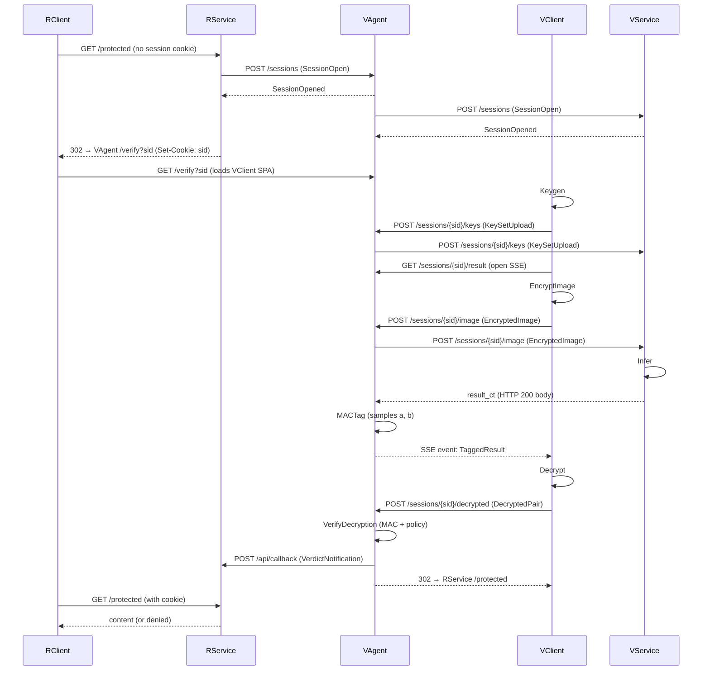

# ppiav — Design

This document captures the design decisions made during brainstorm. Treat it as the single source of truth for the architecture; any deviation in code requires updating this doc first.

**Status:** Sections 1, 2a, 2b, and 2c approved.

---

## 1. Project context

**Goal.** End-to-end demonstrator of privacy-preserving facial-attribute verification: a verification service runs an ML model on an encrypted image and returns an encrypted result; the user decrypts; the verification agent confirms the decryption matches the policy.

**Demonstration case.** Age estimation via C3AE. Phase 1 mocks inference with a trivial CKKS circuit; Phase 2 introduces real C3AE inference via Orion.

**Threat model.**

- **Subject (client) — covert adversary.** May deviate from the protocol to bypass verification but avoids being detected. Defended via Carter–Wegman MAC on the decrypted result (§3.4).
- **Verification side — semi-honest.** Follows the protocol but tries to extract information from observed data. Defended by FHE: it never sees plaintexts.
- **Resource side — semi-honest.** Receives the verdict; never receives personal data.

**Out of scope.** Auth, TLS, rate limiting, presentation-attack detection, malicious-server defenses. These are explicitly deprioritized in the thesis.

---

## 2. Components

The deployable demo has 5 components. The benchmark CLI runs them all in-process.

| Component                       | Role                                                                                  | Tech                                                        |
| ------------------------------- | ------------------------------------------------------------------------------------- | ----------------------------------------------------------- |
| Verification Service (VService) | Runs FHE inference on encrypted image                                                 | Go HTTP server, Docker                                      |
| Verification Agent (VAgent)     | Mediates protocol, generates MAC, applies verdict policy, calls back Resource Service | Go HTTP server, Docker, serves VClient SPA                  |
| Verification Client (VClient)   | Subject side: keygen, encrypt image, decrypt result+MAC, return plaintexts            | Browser SPA (vanilla JS) + WASM (copied Orion `js/lattigo`) |
| Resource Service (RService)     | Owns the gated resource; initiates verification; receives verdict                     | Go HTTP server, Docker, serves RClient SPA                  |
| Resource Client (RClient)       | User-facing protected page                                                            | Browser SPA (vanilla JS)                                    |

Plus:

- **Benchmark CLI (`ppiav-cli`)** — runs any protocol step or end-to-end in-process; emits JSON metrics.
- **`models/`** — Python pipeline: train C3AE, compile to `.orion`. Hardcoded to C3AE (no `--model` dispatch).
- **`bench/`** — Python: matplotlib plots and Markdown/Typst tables from JSON metrics.

---

## 3. Protocol

Mirrors the protocol from `~/Dev/ITMO/thesis/presentation/presentation.typ`.

### 3.1 Session setup

1. RClient → RService: request access to gated resource.
2. RService (server-side, on detecting no valid session) → VAgent: open session.
3. VAgent → VService: open session.
4. RService → RClient: 302 redirect to VAgent's verification page.

### 3.2 Key generation and submission

5. VClient: `Keygen` (CKKS sk, pk, evk).
6. VClient → VAgent → VService: PublicKeySet (pk, evk).

### 3.3 Image encryption and inference

7. VClient: encrypt image into a CKKS ciphertext.
8. VClient → VAgent → VService: encrypted image.
9. VService: FHE inference (Phase 1: `x²`; Phase 2: C3AE).
10. VService → VAgent: result ciphertext.

### 3.4 MAC tagging and decryption

11. VAgent: sample fresh `(a, b)` per session; compute `tag_ct = a · result_ct + b` (plaintext-mul + plaintext-add, no multiplicative depth consumed).
12. VAgent → VClient: (result_ct, tag_ct).
13. VClient: decrypt both → (`result`, `tag`) plaintexts.
14. VClient → VAgent: (`result`, `tag`).
15. VAgent: verify `tag[i] ≈ a[i]·result[i] + b[i]` within `ε` (default `2^-20`, tuned empirically). If MAC fails or policy rejects → VerdictReject.

### 3.5 Verdict delivery

16. VAgent → RService: verdict callback.
17. RClient: navigates back to RService and sees content (or denied).

### 3.6 MAC scheme — Carter–Wegman affine

Per Carter & Wegman (1981, _Universal Classes of Hash Functions_, J. Comp. Sys. Sci. 22, §2): the affine family `t = a·r + b` over a finite field is 2-universal.

In CKKS approximate arithmetic, the verifier accepts within ε. Forge probability per query:

```
P[forge] ≈ 4ε / (|a|_max · |Δr|_min)
```

With `|a|_max = 2^20`, `|Δr|_min = 1`, `ε = 2^-20`: P ≈ `2^-38`. Tunable empirically; bounds go in thesis methodology section.

Single-use: `(a, b)` is generated in `MACTag` and consumed in `VerifyDecryption`. Reuse aborts the session.

---

## 4. Implementation phases

Implementation rule: Phase N must not reach into Phase N+1 work. If a Phase N decision constrains Phase N+1, document it here.

### Phase 1

**Scope:** Real CKKS, synthetic `x²` circuit, CLI + bench harness, no models, no services

**Deliverable:** Go packages (`internal/{protocol,ckks,vclient,vagent,vservice,rservice,bench}`), `cmd/ppiav-cli`, JSON results, Markdown/Typst tables, plots

### Phase 2

**Scope:** Orion-compiled C3AE inference replaces `x²`

**Deliverable:** `models/` Python pipeline (train.py, compile.py), `c3ae.orion` artifact, `internal/ckks` removed (params from manifest)

### Phase 3

**Scope:** HTTP services + browser SPAs

**Deliverable:** `cmd/ppiav-{vservice,vagent,rservice}`, `web/{vclient,rclient,ppiav-crypto}`, Dockerfiles, docker-compose

### Phase 4

**Scope:** Hierarchical rotation keys

**Deliverable:** Extended `web/ppiav-crypto/bridge` (or upstream into Orion's `js/lattigo`), reduced key transmission cost

---

## 5. CKKS parameters (Phase 1, sourced from `~/Dev/orion/examples/c3ae-demo/generate_model.py`)

```
LogN            = 15
LogQ            = [51, 40, 40, 40, 40, 40, 40, 40, 40, 40, 40, 40, 40, 40, 40, 40]
LogP            = [50, 50, 50, 50]
LogDefaultScale = 40
RingType        = standard
```

- 15 multiplicative levels, no bootstrap needed for C3AE.
- `LogQP = 851` < 881-bit threshold for 128-bit security at LogN=15 (HE Standard, uniform ternary).
- Single ciphertext ≈ 3.4 MB before serialization; 16384 max slots.

`internal/ckks` is **planned for removal in Phase 2**: once Orion is wired in, params come from the `.orion` manifest (`Model.client_params()`).

---

## 6. Benchmarks

### 6.1 Steps measured (each a CLI subcommand)

| Step             | Actor    | Metrics                                                                    |
| ---------------- | -------- | -------------------------------------------------------------------------- |
| `keygen`         | VClient  | wall, mem, pk size, evk size                                               |
| `encrypt-image`  | VClient  | wall, ciphertext size                                                      |
| `infer`          | VService | wall, mem, output ciphertext size                                          |
| `mac`            | VAgent   | wall, tagged ciphertext size                                               |
| `decrypt-result` | VClient  | wall                                                                       |
| `verify-mac`     | VAgent   | wall, accept/reject                                                        |
| `e2e`            | all      | wall (split per phase: setup, transfer, verify), total bytes per direction |

Phase granularity (`session-setup`, `data-transfer`, `result-decrypt`) is reported as derived aggregates.

### 6.2 Memory metrics

Primary: Go `runtime.MemStats` — `HeapAlloc`, `HeapInuse`, `Sys`, `NumGC`, `PauseTotalNs`. Reproducible, fine-grained, OS-portable.

Secondary (Linux only): `/proc/self/status` `VmHWM` for true peak RSS as a sanity-check companion to `MemStats.Sys`.

For object sizes:

- **Serialized** — `len(obj.MarshalBinary())`. Deterministic. This is the wire-relevant number.
- **In-memory** — `MemStats.HeapAlloc` delta around allocation. Approximate.

### 6.3 Transmission latency model

Latency = `bytes / bandwidth + RTT`, computed for bandwidths `{1, 10, 100, 1000} MB/s` with `RTT = 20 ms`. Documented as a model assumption (typical wired internet).

### 6.4 Output

Go CLI emits JSON (per-bench, per-phase). Python scripts in `./bench/` consume JSON:

- `plot.py` — matplotlib PNG plots
- `tables.py` — Markdown (for README) and Typst (for thesis `#include`) tables

No LaTeX anywhere in the project.

> TODO: design model benchmarks: compare accuracy, FNR/FPR of clean and FHE-compatible models. Two factors: ReLU replacement with polynomial and FHE-noise

---

## 7. Repo layout

```
ppiav/
├── cmd/
│   ├── ppiav-cli/                     # Phase 1+ benchmark CLI
│   ├── ppiav-vservice/                # Phase 3+
│   ├── ppiav-vagent/                  # Phase 3+
│   └── ppiav-rservice/                # Phase 3+
├── internal/
│   ├── protocol/                      # Domain types, message types, MAC scheme
│   ├── ckks/                          # Phase 1 only — REMOVED in Phase 2
│   ├── vclient/                       # Subject-side crypto
│   ├── vagent/                        # Agent: MAC, verdict
│   ├── vservice/                      # Server: FHE inference
│   ├── rservice/                      # Resource gating
│   └── bench/                         # Measurement harness
├── web/
│   ├── ppiav-crypto/                  # WASM module — copy of Orion's js/lattigo with our additions
│   │   ├── bridge/
│   │   │   ├── main.go                # Calls RegisterJS() of subpackages
│   │   │   ├── lattigo/               # package lattigo — copied from Orion
│   │   │   └── ppiav/                 # package ppiav — protocol-shaped APIs, imports internal/vclient
│   │   ├── src/
│   │   │   ├── lattigo/               # TS wrappers (copied)
│   │   │   ├── ppiav/                 # TS wrappers for protocol APIs
│   │   │   └── index.ts
│   │   ├── tests/
│   │   ├── package.json               # name: "ppiav-crypto"
│   │   ├── tsconfig.json, eslint.config.js, vitest.config.ts
│   │   └── build.sh
│   ├── vclient/                       # SPA served by VAgent
│   └── rclient/                       # SPA served by RService
├── models/                            # Phase 2+ Python uv project (hardcoded C3AE)
│   ├── pyproject.toml
│   ├── c3ae.py
│   ├── train.py
│   ├── compile.py
│   └── data/                          # gitignored
├── bench/                             # Phase 1+ Python uv project (plotting, tables)
│   ├── pyproject.toml
│   ├── plot.py
│   └── tables.py
├── deploy/                            # Phase 3+ Dockerfiles
├── results/                           # JSON + plots (selectively committed snapshots)
├── docs/
│   └── DESIGN.md                      # this file
├── go.mod
└── README.md
```

**Notes.**

- Single Go module. `internal/` enforces "this is a thesis prototype, not a library."
- `web/ppiav-crypto/` is one WASM module, not two — see §8.
- `models/` and `bench/` are separate uv projects (different deps, different concerns).

---

## 8. Browser-side architecture

- **One WASM module** (`web/ppiav-crypto`), copied from Orion's `js/lattigo` and renamed. Exposes both Lattigo low-level APIs (under `globalThis.lattigo`) and our protocol-shaped APIs (under `globalThis.ppiav`) — separated into Go subpackages `bridge/lattigo` and `bridge/ppiav` so concerns don't tangle.
- **Bridge entry point.** `bridge/main.go` (`//go:build js && wasm`) calls `lattigo.RegisterJS()` then `ppiav.RegisterJS()`, then blocks. Each package attaches its handlers under its own JS namespace.
- **`bridge/ppiav` imports `internal/vclient`.** This is the win: the actual crypto sequence (slot packing, encoding, encryption) is **shared between the CLI binary and the WASM binary** — same Go function. Browser is not a parallel reimplementation.
- **No separate `bridge/go.mod`.** Same Go module as the rest of ppiav, so `internal/` imports work without `go.work` gymnastics.
- **Constraint:** `internal/vclient` must compile under both `linux/amd64` and `js/wasm`. Pure Go only — no cgo, no `os.Open` on filesystem paths, no `os/exec`. Lattigo and lattigo-hierkeys are pure Go, so this holds.
- **JS side:** vanilla JS, no TypeScript at the `web/vclient` and `web/rclient` SPA level (Orion's TS wrappers in `src/` come along when we copy and stay TS for type safety inside the WASM module).

**Phase 4 implication.** Hierarchical rotation keys need WASM access. Add hierkeys to ppiav-crypto WASM bridge.

---

## 9. Resource access flow



1. Browser GETs `RService /protected` (no session cookie on first visit).
2. RService has no valid session → server-side, allocates `sid` and calls `POST /sessions` on VAgent.
3. RService records `sid` in its session table and sets a session cookie identifying this browser; responds with `302 Found` to `VAgent /verify?sid=...`.
4. Browser follows the redirect; VAgent serves the VClient SPA at `/verify`.
5. VClient runs the protocol (file upload → keygen → encrypt → upload → SSE-stream tagged result → decrypt → POST plaintexts).
6. VAgent verifies MAC + policy, calls `POST /api/callback` on RService with the verdict; RService writes verdict into its session table for `sid`.
7. VAgent responds to VClient's last POST with a `302 Found` to `RService /protected`.
8. Browser GETs `RService /protected` (with the cookie set in step 3); RService reads `sid` from cookie → looks up verdict → serves content (or denied page).

**Decisions:**

- **Image source:** file upload (drag-and-drop / file picker). No webcam — adds permissions complexity unrelated to the FHE story.
- **Resource:** stub page ("Доступ предоставлен" + verdict JSON). Real content gating is out of scope.
- **Session correlation:** RService stores `sid` server-side and identifies the browser via an unsigned session cookie set on the redirect. Callback path delivers the verdict; redirect handles UX. Cookie spoofing defense and signed tokens are "auth", out of scope.
- **Result delivery to client:** SSE (`text/event-stream`) with `Flusher.Flush()`. Native `EventSource` in browser, ~15 lines of Go handler.
- **Wire format:** JSON for control messages; `application/octet-stream` for ciphertext-bearing endpoints. No base64 inflation.

---

## 10. Section 2a: Foundational packages (APPROVED)

### `internal/ckks` (Phase 1 only; removed in Phase 2)

```go
// Package ckks holds CKKS parameters used by Phase 1's synthetic circuit.
//
// REMOVED IN PHASE 2: Once Orion is wired in, parameters are loaded from
// the .orion manifest (Model.client_params()), and this package is deleted.
// Do not extend it — add new param logic in the model loader instead.
package ckks

import (
    "github.com/tuneinsight/lattigo/v6/schemes/ckks"
    "github.com/tuneinsight/lattigo/v6/ring"
)

func DefaultParams() (ckks.Parameters, error) {
    return ckks.NewParametersFromLiteral(ckks.ParametersLiteral{
        LogN:            15,
        LogQ:            []int{51, 40, 40, 40, 40, 40, 40, 40, 40, 40, 40, 40, 40, 40, 40, 40},
        LogP:            []int{50, 50, 50, 50},
        LogDefaultScale: 40,
        RingType:        ring.Standard,
    })
}
```

### `internal/protocol`

Domain types are first-class; bytes only at wire boundary. All Lattigo wire-relevant types implement `encoding.BinaryMarshaler`/`BinaryUnmarshaler` natively (verified in `~/Dev/3rd-party/lattigo/core/rlwe/keys.go` and `element.go`).

```go
// internal/protocol/types.go
package protocol

import "github.com/tuneinsight/lattigo/v6/core/rlwe"

type SessionID string

type Verdict uint8
const (
    VerdictUnknown Verdict = iota
    VerdictAccept
    VerdictReject
)

type PublicKeySet struct {
    PK  *rlwe.PublicKey
    Evk *rlwe.MemEvaluationKeySet
}

func (m PublicKeySet) MarshalBinary() ([]byte, error)
func (m *PublicKeySet) UnmarshalBinary(data []byte) error
```

Ciphertexts are passed as `*rlwe.Ciphertext` directly — no wrapper. `*rlwe.Ciphertext` already satisfies `BinaryMarshaler` via embedded `Element[ring.Poly]`.

#### MAC scheme

```go
// internal/protocol/mac.go
package protocol

import (
    "math"
    "github.com/tuneinsight/lattigo/v6/core/rlwe"
    "github.com/tuneinsight/lattigo/v6/schemes/ckks"
)

type MACSecret struct {
    A, B []float64 // per-slot
}

func NewMACSecret(slots int, aBound, bBound float64) (MACSecret, error)

func (s MACSecret) Verify(result, tag []float64, eps float64) bool {
    if len(result) != len(s.A) || len(tag) != len(s.A) { return false }
    for i := range s.A {
        if math.Abs(s.A[i]*result[i] + s.B[i] - tag[i]) > eps { return false }
    }
    return true
}

func (s *MACSecret) Zero()  // explicit wipe of crypto state

// ApplyHomomorphic computes tag_ct = a·result_ct + b on encrypted input
// (plaintext-mul + plaintext-add).
func (s MACSecret) ApplyHomomorphic(
    enc *ckks.Encoder,
    eval *ckks.Evaluator,
    resultCt *rlwe.Ciphertext,
) (*rlwe.Ciphertext, error)
```

#### Wire messages — Convention A (payload nouns)

```go
// internal/protocol/messages.go
package protocol

import "github.com/tuneinsight/lattigo/v6/core/rlwe"

type SessionOpen          struct{}
type SessionOpened        struct { SessionID SessionID }
type KeySetUpload         struct { Keys PublicKeySet }
type EncryptedImage       struct { Ct *rlwe.Ciphertext }
type TaggedResult         struct { Result, Tag *rlwe.Ciphertext }
type DecryptedPair        struct { Result, Tag []float64 }
type VerdictNotification  struct { Verdict Verdict }
```

**Session ID convention.** Only `SessionOpened` carries `SessionID` in the body — VAgent uses it to tell RService which sid was allocated server-to-server. All other messages omit it; HTTP routes carry sid in the URL path (e.g. `POST /sessions/{sid}/keys`) and handlers extract it before calling actor methods. Phase 1 in-process orchestration passes sid as a separate arg.

Single-field wrappers (`KeySetUpload`, `EncryptedImage`, `VerdictNotification`) are kept for consistency and future evolution — adding a field doesn't break the handler contract.

`SessionOpen` is intentionally empty. The protocol presentation slide shows a callback URL flowing from RService to VAgent in the open-session step; we collapse that field because RService↔VAgent are co-deployed by the same operator and pin URLs in config (the OAuth/OIDC pattern). Reintroduce a field if a future scenario requires runtime URL exchange.

**Naming convention:** payload nouns. Direction is implicit in the HTTP route. No `*Request` / `*Response` suffixes (HTTP-RPC pairing is gRPC-flavor; Go REST commonly uses payload structs).

**Architecture invariant:** actor methods take individual domain-type args (idiomatic Go); message types are wire-format only. HTTP handlers in `cmd/*` decode the message, call the actor method, encode the response.

```go
// idiomatic — actor takes domain types, no transport leaking in
func (a *Agent) StoreKeys(sid protocol.SessionID, keys protocol.PublicKeySet) error

// at HTTP boundary — handler extracts sid from URL path, decodes body, calls actor
sid := protocol.SessionID(chi.URLParam(r, "sid"))
var msg protocol.KeySetUpload
json.NewDecoder(r.Body).Decode(&msg)
if err := h.agent.StoreKeys(sid, msg.Keys); err != nil { /* 4xx */ }
w.WriteHeader(http.StatusOK)
```

**Note on style:** no `var _ Iface = (*T)(nil)` compile-time interface assertions. Per project preference; Lattigo interface conformance is verified by usage.

---

## 11. Section 2b: Actor packages (APPROVED)

### `internal/vclient`

```go
package vclient

import (
    "github.com/tuneinsight/lattigo/v6/core/rlwe"
    "github.com/tuneinsight/lattigo/v6/schemes/ckks"
    "github.com/butvinm/ppiav/internal/protocol"
)

type Client struct {
    params    ckks.Parameters
    sk        *rlwe.SecretKey
    encoder   *ckks.Encoder
    encryptor *rlwe.Encryptor
    decryptor *rlwe.Decryptor
}

func New(params ckks.Parameters) *Client

func (c *Client) Keygen() (protocol.PublicKeySet, error)
func (c *Client) EncryptImage(image []float64) (*rlwe.Ciphertext, error)
func (c *Client) Decrypt(resultCt, tagCt *rlwe.Ciphertext) (result, tag []float64, err error)
```

### `internal/vagent`

```go
package vagent

import (
    "sync"
    "github.com/tuneinsight/lattigo/v6/core/rlwe"
    "github.com/tuneinsight/lattigo/v6/schemes/ckks"
    "github.com/butvinm/ppiav/internal/protocol"
)

type Agent struct {
    params   ckks.Parameters
    eps      float64
    encoder  *ckks.Encoder
    eval     *ckks.Evaluator   // constructed with nil EvaluationKeySet — shared across sessions
    sessions map[protocol.SessionID]*sessionState
    mu       sync.Mutex
}

type sessionState struct {
    keys protocol.PublicKeySet
    mac  protocol.MACSecret
}

func New(params ckks.Parameters, eps float64) (*Agent, error)

func (a *Agent) OpenSession() protocol.SessionID
func (a *Agent) StoreKeys(sid protocol.SessionID, keys protocol.PublicKeySet) error
func (a *Agent) MACTag(sid protocol.SessionID, resultCt *rlwe.Ciphertext) (*rlwe.Ciphertext, error)
func (a *Agent) VerifyDecryption(sid protocol.SessionID, result, tag []float64) (protocol.Verdict, error)
```

### `internal/vservice`

```go
package vservice

import (
    "sync"
    "github.com/tuneinsight/lattigo/v6/core/rlwe"
    "github.com/tuneinsight/lattigo/v6/schemes/ckks"
    "github.com/butvinm/ppiav/internal/protocol"
)

type Service struct {
    params   ckks.Parameters
    sessions map[protocol.SessionID]*sessionState
    mu       sync.Mutex
}

type sessionState struct {
    eval *ckks.Evaluator
}

func New(params ckks.Parameters) *Service

func (s *Service) OpenSession(sid protocol.SessionID) error
func (s *Service) StoreKeys(sid protocol.SessionID, keys protocol.PublicKeySet) error
func (s *Service) Infer(sid protocol.SessionID, inputCt *rlwe.Ciphertext) (*rlwe.Ciphertext, error)
```

### `internal/rservice`

```go
package rservice

import (
    "sync"
    "time"
    "github.com/butvinm/ppiav/internal/protocol"
)

type Service struct {
    sessions map[protocol.SessionID]*sessionState
    mu       sync.Mutex
}

type sessionState struct {
    verdict protocol.Verdict
    expires time.Time
}

func New() *Service

func (s *Service) StartVerification() (sid protocol.SessionID)
func (s *Service) AcceptVerdict(sid protocol.SessionID, v protocol.Verdict) error
func (s *Service) CheckAccess(sid protocol.SessionID) protocol.Verdict
```

### Architecture invariants

1. **No actor depends on another actor's package.** All depend on `internal/protocol` and Lattigo. Phase 3 HTTP handlers in `cmd/*` orchestrate calls between actors via injected HTTP clients.
2. **Actors are transport-agnostic.** No actor holds URLs, HTTP clients, retry policies, or any other transport state. Phase 1 CLI orchestrates by calling actor methods in sequence. Phase 3 HTTP handlers in `cmd/*` hold the transport state (URLs from config, `*http.Client`) and orchestrate the same way over the wire. Same actors, two orchestrators.
3. **Sessions are owned by the actor that creates them.** RService creates sids in `StartVerification`. VAgent and VService receive sids via `OpenSession`/`StoreKeys` — they don't generate their own.
4. **MAC state is single-use.** `MACTag` writes `mac` to session; `VerifyDecryption` reads it once and zeroes. Subsequent verifies on the same session error out.
5. **Keys live where they're used.** `vclient` holds `sk`. `vagent` holds `PublicKeySet` (forwarded for protocol completeness). `vservice` builds an `Evaluator` per-session from the evk.

### Resolved concerns

- **`vagent.eval` shared across sessions vs per-session.** _Resolved: shared._ Verified that `ckks.NewEvaluator(params, nil)` constructs successfully and supports `MulNew(ct, plaintext)` + `AddNew(ct, plaintext)` + `Rescale` for the MAC step (verification script: `/tmp/ppiav-scratch/eval_no_keys/main.go`; output confirmed `1.5·2.0 + 0.5 ≈ 3.5` with ~7e-6 CKKS noise; `MulRelinNew(ct, ct)` correctly errors on nil keyset). One `*ckks.Evaluator` per `Agent`, constructed in `New()`.

- **`StartVerification` redirect URL location.** _Resolved: not in the actor._ Both URLs (RService→VAgent redirect, VAgent→RService callback) are deployment config-time constants — RService and VAgent are co-deployed by the same operator (server↔Keycloak pattern). Holding URLs on actor structs would force Phase 1 to invent values it doesn't need. The Phase 3 HTTP handlers in `cmd/ppiav-{rservice,vagent}` hold the URLs from config; they call actor methods (sid in, sid out) and build/POST URLs themselves. `SessionOpen` is correspondingly empty; `RService.StartVerification()` returns only sid.

---

## 12. Section 2c: Bench package (APPROVED)

`internal/bench` is the measurement harness used by `cmd/ppiav-cli` (and any test wanting reproducible perf data). Pure Go, no external deps beyond stdlib + `runtime/debug`.

```go
// internal/bench/bench.go
package bench

import (
    "runtime"
    "time"
)

type Sample struct {
    Name       string        `json:"name"`
    Iter       int           `json:"iter,omitempty"`               // 0..N-1 within a Repeat batch
    Wall       time.Duration `json:"wall_ns,omitempty"`
    HeapAlloc  uint64        `json:"heap_alloc_bytes,omitempty"`   // post-call HeapAlloc
    HeapInuse  uint64        `json:"heap_inuse_bytes,omitempty"`   // post-call HeapInuse
    Sys        uint64        `json:"sys_bytes,omitempty"`          // post-call Sys (total from OS)
    AllocDelta uint64        `json:"alloc_delta_bytes,omitempty"`  // (HeapAlloc - pre.HeapAlloc); 0 if GC ran
    NumGC      uint32        `json:"num_gc_in_call,omitempty"`     // GC cycles during the call
    PauseNs    uint64        `json:"pause_ns_in_call,omitempty"`   // total GC pause during the call
    VmHWM      uint64        `json:"vmhwm_bytes,omitempty"`        // Linux peak RSS, 0 elsewhere
    Bytes      uint64        `json:"bytes,omitempty"`              // optional artifact size
}

func Measure(name string, fn func() error) (Sample, error)
func MeasureWithSize(name string, fn func() (size uint64, err error)) (Sample, error)
func Repeat(n int, name string, fn func() error) ([]Sample, error)
func RepeatWithWarmup(n, warmup int, name string, fn func() error) ([]Sample, error)

// Linux-only; returns 0 elsewhere. Reads /proc/self/status VmHWM.
func readVmHWM() uint64
```

```go
// internal/bench/run.go
package bench

import "time"

type Run struct {
    Name      string         `json:"name"`
    Phase     string         `json:"phase"`
    Started   time.Time      `json:"started"`
    GoVersion string         `json:"go_version"`
    GOOS      string         `json:"goos"`
    GOARCH    string         `json:"goarch"`
    NumCPU    int            `json:"num_cpu"`
    Metadata  map[string]any `json:"metadata"`
    Samples   []Sample       `json:"samples"`
}

func NewRun(name, phase string) *Run
func (r *Run) Append(s ...Sample)
func (r *Run) WriteJSON(path string) error  // pretty-printed for git-friendly diffs
```

**Usage shape (in `cmd/ppiav-cli`):**

```go
run := bench.NewRun("phase1-keygen", "1")
run.Metadata["ckks_params"] = ckksParamsAsMap(params)

samples, _ := bench.RepeatWithWarmup(*n, 1, "keygen", func() error {
    _, err := vclient.Keygen()
    return err
})
run.Append(samples...)

// Artifact-size samples are constructed manually (no time/memory dimensions).
keys, _ := vclient.Keygen()
pkBytes, _ := keys.PK.MarshalBinary()
evkBytes, _ := keys.Evk.MarshalBinary()
run.Append(
    bench.Sample{Name: "pk_size",  Bytes: uint64(len(pkBytes))},
    bench.Sample{Name: "evk_size", Bytes: uint64(len(evkBytes))},
)

run.WriteJSON("results/phase1/keygen.json")
```

**Design notes:**

- **One sample per iteration, no aggregation in Go.** Mean / stddev / percentiles are computed in `bench/plot.py` and `bench/tables.py`. Keeps Go simple and lets analysis evolve without recompilation.
- **Warmup is mandatory-by-default convention.** Lattigo's `NewParametersFromLiteral` and similar init paths have one-time costs (NTT tables, sampling structures). Without warmup, sample 0 is consistently slower than steady-state and pollutes the mean. `RepeatWithWarmup(n, 1, ...)` is the recommended call shape.
- **Memory deltas can be negative if GC runs during the call.** `AllocDelta` is clipped to 0 in that case; `NumGC > 0` flags it for the analysis script to discard or note.
- **No timer ceremony for the user.** `Measure`/`Repeat` own the `time.Now()` calls, the `runtime.ReadMemStats` calls, and the `readVmHWM` calls.
- **Single `Sample` type with `omitempty` everywhere.** Bytes-only samples (pk_size, evk_size) leave Wall, Heap\*, Sys, etc. zero and they're elided from JSON. One type to reason about, no JSON bloat.
- **Artifact-size measurement is separate from time/memory measurement.** Sizes are deterministic (`len(MarshalBinary())`) and don't need warmup or repetition.
- **No nested measurements.** `e2e` and per-step samples live as separate entries (or separate `Run`s); `bench/plot.py` reconciles them across files.
- **Pretty-printed JSON.** Run files in `results/phase{1,2,3,4}/*.json` are git-diff-readable when we commit snapshot results.

**Out of scope for §12:** the CLI command surface (`ppiav-cli keygen --n 10`, `ppiav-cli e2e --bandwidth 100`, etc.) belongs to a future Phase 1 implementation plan, not this design doc. `internal/bench` is the harness; `cmd/ppiav-cli` is the user-facing CLI that uses it.

---

## 13. Open items (all non-blocking)

- Phase 1 milestone artifact list — concrete deliverables checklist.
- Test strategy — Go unit tests per package, integration test running the full protocol in-process, no CI initially.
- Docker layout — Phase 3, multi-stage Alpine builds, one Dockerfile per service in `deploy/`.
- Configuration management — env vars vs flags vs config file. Defer to Phase 3.
- License — defer.
- Whether to write the thesis text in Typst (presentation already is). If so, `bench/tables.py` Typst output integrates directly.
